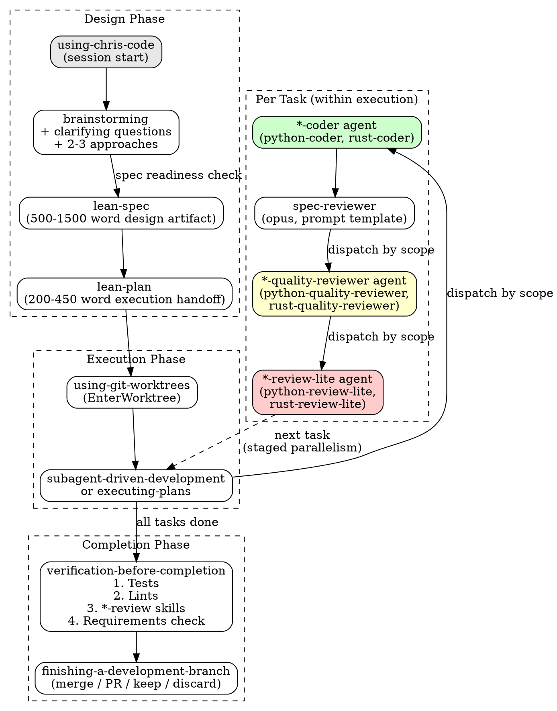

# chris-code

Personal Claude Code plugin — workflow skills, coding agents, review gates, and quality campaigns.

## Workflow

The core workflow is a linear pipeline from idea to integration. Each step invokes specific skills and dispatches agents automatically.



## Skills

### Workflow Skills (pipeline order)

| Skill | Purpose | Invoked by |
|-------|---------|------------|
| `using-chris-code` | Session-start skill discovery | Plugin system (auto) |
| `brainstorming` | Explore intent, requirements, design before implementation | User or using-chris-code |
| `lean-spec` | Write canonical design spec (500-1500 words) | brainstorming (step 7) |
| `lean-plan` | Write thin execution handoff (200-450 words) | brainstorming (step 10) |
| `using-git-worktrees` | Isolated workspace via EnterWorktree | executing-plans / subagent-driven-dev |
| `subagent-driven-development` | Execute plan with fresh subagent per task, staged parallelism | lean-plan handoff |
| `executing-plans` | Execute plan inline (no subagents) | lean-plan handoff (alternative) |
| `dispatching-parallel-agents` | Dispatch 2+ independent tasks concurrently | Any skill needing parallelism |
| `test-driven-development` | RED-GREEN-REFACTOR cycle | Coder agents during implementation |
| `systematic-debugging` | Four-phase root cause investigation | When bugs arise |
| `verification-before-completion` | Tests + lints + full review + requirements check | Before claiming done |
| `finishing-a-development-branch` | Merge / PR / keep / discard + worktree cleanup | After verification passes |
| `requesting-code-review` | Ad-hoc review (fresh perspective, pre-refactor) | User-triggered |
| `receiving-code-review` | Handle review feedback with technical rigor | When review feedback received |
| `writing-skills` | TDD applied to skill creation | When creating/editing skills |
| `regression-test` | Write regression tests after bug fixes | systematic-debugging (phase 4) |

### Standalone Skills (user-invoked, not in pipeline)

| Skill | Purpose |
|-------|---------|
| `python-review` | Senior-level Python refactoring & API-design review |
| `rust-review` | Senior-level Rust refactoring & API-design review |
| `bug-hunt` | Parallel edge-case test campaign across subsystems |
| `test-sweep` | Iterative combinatorial test-and-fix campaign |
| `code-archaeology` | Find dead code, unimplemented features, spec gaps |
| `release` | Version bump + changelog + GitHub release |

## Agents

### Coding Agents

Dispatched by `subagent-driven-development` and `executing-plans` via `scope.extensions` matching.

| Agent | Model | Scope | Role |
|-------|-------|-------|------|
| `python-coder` | sonnet | `.py` | Python implementation with embedded review principles |
| `rust-coder` | sonnet | `.rs` | Rust implementation with embedded review principles |

### Quality Review Agents

Dispatched per task after spec compliance review passes.

| Agent | Model | Scope | Role |
|-------|-------|-------|------|
| `python-quality-reviewer` | opus | `.py` | Verify coder followed principles + bug detection |
| `rust-quality-reviewer` | opus | `.rs` | Verify coder followed principles + bug detection |

### Commit Gate Agents

Dispatched before each commit and as a final full-diff pass at plan end.

| Agent | Model | Scope | Role |
|-------|-------|-------|------|
| `python-review-lite` | sonnet | `.py` | Idiom checklist + linter, returns clean/block/escalate |
| `rust-review-lite` | sonnet | `.rs` | Idiom checklist + clippy, returns clean/block/escalate |

### Campaign Agent

Dispatched by the `bug-hunt` skill.

| Agent | Model | Scope | Role |
|-------|-------|-------|------|
| `bug-hunter` | sonnet | per dispatch | Adversarial edge-case test writer, never fixes |

## Scope Dispatch

All agents and review skills use a consistent scope-matching mechanism:

1. Check file extensions in the staged diff or task file list
2. Match against `scope.extensions` in agent/skill frontmatter
3. If multiple match the same extension, resolve via `scope.require_dependencies` (check project dependency files: `pyproject.toml`, `requirements.txt`, `Cargo.toml`, `package.json`)
4. More specific agents take priority when their dependencies are present

This enables extensibility — adding `pytorch-coder`, `pytorch-quality-reviewer`, `pytorch-review-lite`, and `pytorch-review` requires no changes to any existing skill.

## Model Selection

| Model | When |
|-------|------|
| **Haiku** | Isolated functions, clear spec, 1-2 files, mechanical changes |
| **Sonnet** | Multi-file coordination, integration concerns, pattern matching |
| **Opus** | Architecture decisions, design judgment, reviews, broad codebase understanding |

Announce the model and agent on every dispatch: "Dispatching sonnet python-coder agent for Task 3 (add utility function)"

## Installation

```bash
# In settings.json, add to extraKnownMarketplaces:
"chris-code": {
  "source": {
    "source": "directory",
    "path": "/Users/chrissantiago/Dropbox/claude-config/plugins"
  },
  "autoUpdate": true
}

# And enable in enabledPlugins:
"chris-code@chris-code": true
```
