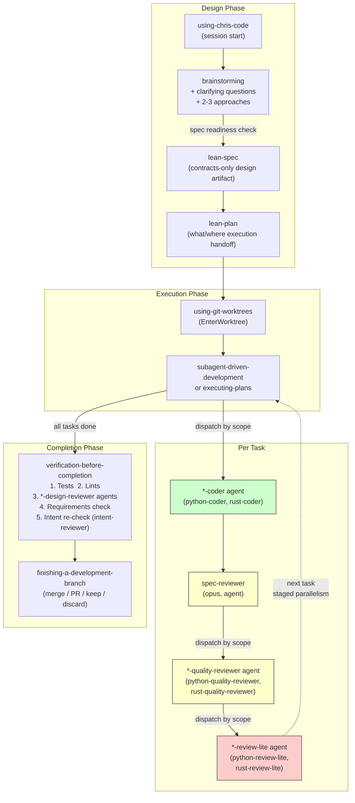
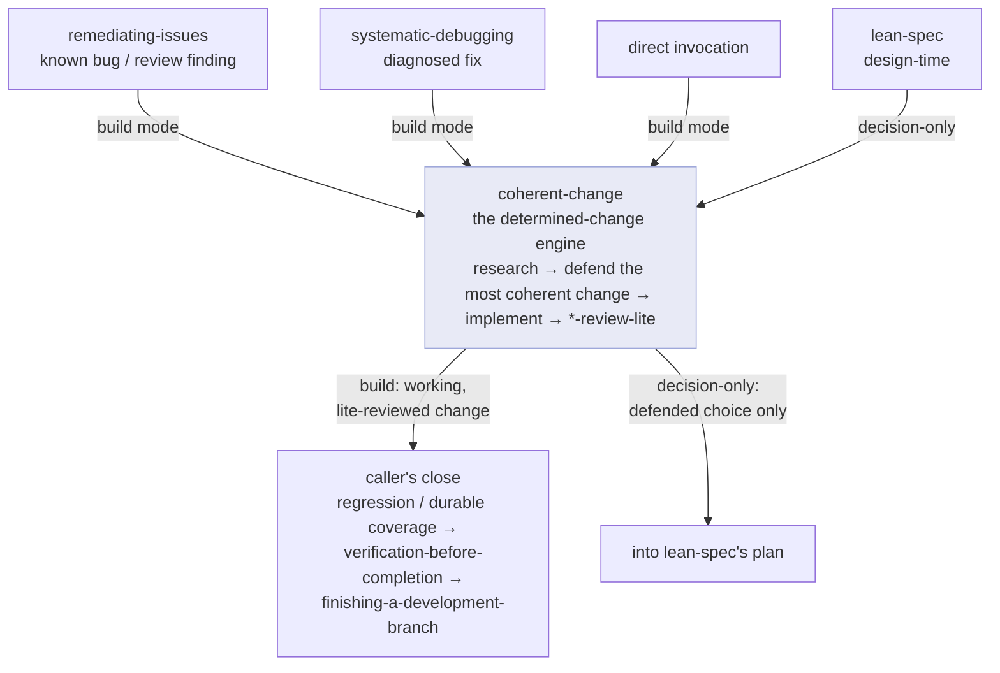

# chris-code

Personal Claude Code plugin — workflow skills, coding agents, review gates, and quality campaigns.

chris-code turns Claude Code into an opinionated software-engineering workflow rather than a free-form chat assistant. Once installed, it routes any non-trivial change through a fixed pipeline — brainstorm intent, write a lean spec, hand off a thin plan, dispatch a coder subagent per task, run two-stage review (spec compliance, then code quality), and gate every commit with a lint-aware idiom check. Use it when you want Claude to design before it codes, keep the main context window clean by offloading work to focused subagents, and catch agent-generated drift before it reaches `main`. Drop into any repo, type `/brainstorming` (or just describe a feature), and the workflow takes over from there.

## Based on Superpowers

chris-code is derived from [obra/superpowers](https://github.com/obra/superpowers), redesigned around three problems observed in practice:

**Spec and plan bloat.** Superpowers specs grew to 2500+ words with file maps, step-by-step instructions, and inline code scaffolds. Plans added another 5,000–10,000 words of code blocks that implementing agents routinely ignored and rewrote. chris-code enforces a "contracts stay, choreography goes" principle: specs cover only the invariants that survive architectural change, and plans are thin execution handoffs with no inline code unless an exact schema is required. A word-efficiency principle keeps both lean — every line must be load-bearing — rather than a fixed word budget.

**Shadow code.** Superpowers' writing-plans mandated "complete code in every step." In practice this produced prescriptive scaffolding that agents discarded — the work of writing it was wasted and the mismatch between plan code and actual codebase state caused confusion. chris-code plans tell executors *what* to do and *where*, trusting agents to read the spec and write code fit for the real codebase.

**Inconsistent review discipline.** superpowers already runs two-stage review (spec compliance, then code quality) per task via dispatched reviewer subagents. chris-code keeps those gates but applies them uniformly through dedicated, scope-dispatched agents, adds a lint-aware pre-commit gate, and maps file footprints before dispatch to serialize tasks with overlapping files. The spec-reviewer agent keeps a "Do Not Trust the Report" check: verify implementations by reading actual code, not agent summaries.

<h2>Coming from superpowers? Read this first.</h2>

chris-code branched from [obra/superpowers](https://github.com/obra/superpowers) **v5.1.0** and has since selectively backported mechanisms from **v6.0.0** (file handoffs, pre-flight plan review, a durable progress ledger, reviewer-integrity rules — see *Execution mechanics*). The comparison below is framed against the v5.1.0 fork point, where most of chris-code's design diverged; the v6 backports sit on top of it. If you know superpowers, you already know 80% of chris-code: the same brainstorm → plan → execute → review → finish pipeline, most of the same skill names, the same TDD and systematic-debugging discipline. This doc explains the 20% that changed and, more importantly, *why*.

## TL;DR

Day to day, three things feel different:

1. **Your specs and plans get shorter.** chris-code refuses to write 2,500-word specs and 10,000-word plans full of code the implementer will throw away. Specs capture contracts, plans capture *what and where*, and the code gets written against the real codebase, not the plan.
2. **Coding and review run through dedicated agents, not generic subagents.** chris-code ships named `*-coder`, `*-quality-reviewer`, and `*-review-lite` agents that auto-dispatch by file type. You rarely pick one by hand.
3. **Every task passes the same review gates.** Spec compliance, then code quality, then a pre-commit idiom/lint gate. No task is "small enough to skip."

Everything below is the reasoning behind those, then the specifics.

---

## The big picture: five thematic shifts

### 1. Lean artifacts over exhaustive ones

**The why.** superpowers' `writing-plans` told you to document everything "as if the engineer has zero context," with complete code in every step. In practice, implementing agents ignored the pasted code and wrote their own, so the effort was wasted and the plan-vs-reality mismatch caused confusion.

chris-code adopts **"contracts stay, choreography goes."** A spec records only the invariants that survive an architectural rewrite. A plan tells the executor *what* to do and *where*, and trusts it to write code that fits the actual repo. A word-efficiency principle keeps it honest: every line must be load-bearing, and length is a smell rather than a limit.

### 2. A real agent layer, dispatched by scope

**The why.** superpowers is skills-only. Its coding and review happen inline or through generic subagents steered by prompt-template files (`implementer-prompt.md`, `code-reviewer.md`). That works, but every dispatch is hand-rolled.

chris-code adds **thirteen dedicated agents** with frontmatter scoping. The right one fires automatically based on file extension and project dependencies: `pytorch-coder` wins over `python-coder` in a torch project; all matching `*-quality-reviewer`s fire additively. You describe the task; the routing is mechanical.

### 3. Review is a uniform, multi-stage gate

**The why.** superpowers already reviews every task in two stages (spec compliance, then code quality) through dispatched reviewer subagents, plus a final whole-branch pass. chris-code keeps that spine and hardens it: the reviewers are dedicated, scope-dispatched agents rather than generic subagents driven by prompt templates; lint becomes its own mandatory gate; a `*-review-lite` idiom check runs pre-commit; and a final full-diff pass catches cross-task drift. Every gate re-reads the actual code, not the agent's summary ("Do Not Trust the Report").

A more recent pass hardens *assurance* — what the gates actually prove:

- **The conformance pair.** `spec-reviewer` (code↔spec) is joined by a spec-blind `intent-reviewer` that re-checks shipped behavior against a **frozen intent ledger** — ≤7 observable acceptance statements captured in the user's words during brainstorming. It catches the one failure no conformance gate can: a spec that itself drifted from the original ask.
- **Integrator grounding.** "Do Not Trust the Report" is turned back on the orchestrator. Before integrating a *judgment-shaped* verdict (a cohesion call, a "cannot verify," a conflict), it re-reads the actual code slice rather than the summary — and reviewers flag their own lossiness to point it where to look.
- **Honest gates.** The pipeline states plainly that more passes raise *recall*, not residual assurance: only ~2 axes are truly independent (a deterministic linter, a spec-blind check), so diversity is weighted over repetition, and checklists are treated as a floor, not a ceiling.

### 4. Parallelism is a feature, not a footgun

**The why.** This one is a direct reversal. superpowers lists "dispatch multiple implementation subagents in parallel" as a **Red Flag** (they conflict). chris-code maps each task's file footprint up front, groups non-overlapping tasks into stages, and runs each stage concurrently. Same safety concern, solved by scheduling instead of prohibition.

### 5. Native tools first, with hard gates

**The why.** superpowers already prefers native worktree tools (its rewrite names `EnterWorktree`) and asks consent, falling back to a manual `git worktree` only when no native tool exists, and announcing the fallback when it happens. chris-code shares that native-first preference but replaces the fallback with a **hard gate**: if the native tool is unavailable, **stop and warn**, never fall back to working in place. The gate exists because a silent fallback once caused real damage (subagents targeting the wrong directory).

There's also a quieter sixth shift in **voice**: chris-code strips superpowers' persuasion scaffolding (Real-World-Impact stat blocks, "Red Flags - STOP" lists, rationalization tables, the "your human partner" framing) in favor of terse, mechanical instructions. Same rules, less rhetoric.

---

## What stayed the same

If you relied on these, they carry over essentially unchanged (renames and diagram-format swaps aside):

- **brainstorming** still gates creative work and runs the same intent → approaches → design flow.
- **test-driven-development** still enforces RED-GREEN-REFACTOR.
- **systematic-debugging** still runs the same four-phase root-cause method with the Iron Law and architecture-questioning phase.
- **finishing-a-development-branch** still offers the same merge / PR / keep / discard menu.
- **dispatching-parallel-agents**, **receiving-code-review**, and the session-start discovery skill (now `using-chris-code`) are the superpowers skills with light edits.

---

## Large divergences in skills you already know

These four are the ones where muscle memory will mislead you. Framed as before → after:

| Skill | superpowers | chris-code |
|---|---|---|
| **writing-plans** | The plan skill: exhaustive, full code in every step. (The spec comes from brainstorming.) | **Plan slimmed to `lean-plan`; spec promoted to `lean-spec`.** Spec = contracts only. Plan = what/where handoff, no inline code. |
| **subagent-driven-development** | Two-stage review; parallel implementers discouraged. | **Three gates per task** (spec → quality → commit-lite), scope-based agent selection, and **deliberate staged parallelism** by file footprint. |
| **verification-before-completion** | Single-command gate: "what command proves this? run it." | **Five-step hard pipeline:** Tests → Lints → Full Review (scope-matched `*-design-reviewer` agents) → Requirements → Intent re-check (spec-blind `intent-reviewer`). |
| **requesting-code-review** | The *primary, mandatory* review path. | **Demoted to ad-hoc.** Routine review now lives in the automated agent/skill gates. Base SHA `HEAD~1` → `git merge-base HEAD main`. |

---

## What's new, and why

### New skills (11)

| Skill | Why it exists |
|---|---|
| `lean-spec` | Promotes the spec to a dedicated skill. superpowers produced a design/spec doc inside `brainstorming`; chris-code makes writing it a first-class step. |
| `coherent-change` | The determined-change engine: research the codebase, defend the most coherent implementation against the alternatives, then implement and lite-review. |
| `remediating-issues` | Bug specialization of `coherent-change`: frame the issue, build the fix, then run the regression and verification gates. |
| `regression-test` | Lock in every bug fix with a test for the bug and its siblings before moving on. |
| `python-review` | Senior Python refactor/API-design review as an on-demand pass. |
| `rust-review` | The same, for Rust. |
| `technical-review` | Math/algorithm/numerical-correctness review for ML code, which general review misses. |
| `bug-hunt` | Parallel adversarial edge-case test campaign across subsystems. |
| `test-sweep` | Iterative combinatorial test-and-fix campaign to find API-surface gaps. |
| `code-archaeology` | Surface dead code, stubs, and spec-vs-impl gaps before a milestone. |
| `release` | Version bump + changelog + GitHub release in one flow. |

### New agents (13) — the layer superpowers doesn't have

| Agents | Role |
|---|---|
| `python-coder`, `pytorch-coder`, `rust-coder` | One coder per task, most-specific wins by scope + dependencies. |
| `python-quality-reviewer`, `pytorch-quality-reviewer`, `rust-quality-reviewer` | Additive post-spec quality review; all matching fire. |
| `python-review-lite`, `rust-review-lite` | Fast pre-commit idiom/lint gate returning clean / block / escalate. |
| `python-design-reviewer`, `rust-design-reviewer` | Senior read-only cohesion/API-design review at the verification gate; PASS/CONCERNS. |
| `spec-reviewer`, `intent-reviewer` | Language-agnostic conformance pair: spec↔code per task, and spec-blind behavior↔intent at completion. |
| `bug-hunter` | Adversarial edge-case test writer dispatched by `bug-hunt`; never fixes. |

---

## Smaller and cosmetic changes

- **Renames:** `using-superpowers` → `using-chris-code` (otherwise verbatim); `superpowers:` skill references → `chris-code:` throughout.
- **Diagrams:** Graphviz/DOT examples swapped for Mermaid across skills.
- **Paths:** output dirs moved to `.claude/output/{specs,plans}`; worktrees to `.claude/worktrees/`.
- **Small hooks added to familiar skills:** `test-driven-development` gained a bug-hunter-derived edge-case checklist; `systematic-debugging` gained a "System Boundaries" check (FFI, serialization, type coercion) and a `regression-test` follow-up; `dispatching-parallel-agents` gained a file-footprint check.
- **Dropped everywhere:** Real-World-Impact stats, "Red Flags - STOP" lists, "Common Rationalizations" tables, dated session anecdotes, and "your human partner" phrasing.

## Workflow

The core workflow is a linear pipeline from idea to integration. Each step invokes specific skills and dispatches agents automatically.

### Execution mechanics

Backported from superpowers **v6.0.0** and adapted to chris-code's agent layer, these keep `subagent-driven-development`'s orchestrator context lean and the run recoverable:

- **File handoffs.** Task briefs, implementer reports, and review diffs are written to `.git/sdd/` (per-worktree, uncommitted) via `scripts/task-brief`, `scripts/review-package`, and `scripts/progress`; dispatches pass file paths, never pasted text or diffs.
- **Pre-flight plan review.** Before Task 1, the plan is scanned once for internal conflicts and plan-mandated defects, raised as one batched question.
- **Durable progress ledger.** Each clean task is appended to `.git/sdd/progress.md`; a controller that loses context after compaction resumes from the ledger instead of re-running finished work. TodoWrite stays the live view.
- **Reviewer integrity.** Reviewers are read-only on the checkout (no tree/index/HEAD/branch mutation), treat an implementer's rationale as a claim that never downgrades a finding, and the orchestrator never coaches a reviewer to suppress or pre-rate findings.

## The determined-change engine

The pipeline above is for **design-open** work — when *what to build* is still live. But much engineering is **determined**: the behavior is already settled (a bug to fix, a refactor, an API alignment, an already-specced change) and the only open question is *which implementation best fits the codebase*. That track runs through `coherent-change`.

Its signature output, produced every time, is a **defended choice**: every genuine candidate rooted in how the codebase already solves the problem, the one selected, proof it's correct across *all* affected cases (a per-case table), and why it beats the alternatives on reuse, idiom-fit, contract-preservation, least surprise, and ergonomics. That artifact — not just a working diff — is the point.

`coherent-change` is an **engine, rarely invoked alone.** Front-ends own the *framing* and the *close*, and delegate the *build* to it:

- **`remediating-issues`** — a known bug or review/audit finding. Confirms the issue is real and still open, runs `systematic-debugging`'s root-cause phase, delegates the build, then runs the **bug close**: `regression-test` → `verification-before-completion` → `finishing-a-development-branch`.
- **`systematic-debugging`** — a bug under investigation. Root-causes it, hands the *diagnosed fix* to the engine, then closes.
- **`lean-spec`** — design-time. Calls the engine **decision-only**: it takes just the defended choice into its plan and owns implementation itself.
- **Direct** — invoke it yourself; then *you* are the caller and run the close.

Two modes turn on one question — *does a downstream workflow own implementation?*

- **Build (default).** research → defend → implement (coder agent) → `*-review-lite` self-gate → hand back a working, lite-reviewed change. The caller owns the heavyweight close.
- **Decision-only.** research → defend, then stop and hand back the defended choice (for `lean-spec`, which owns implementation).

The discipline that keeps it honest: a determined change **closes its whole scope** — every sibling branch, producer, and input its intent reaches (the per-case table lists them). No stubs, no "handle the rest later"; only a genuinely separate, larger improvement is logged and deferred.

## Skills

### Workflow Skills (pipeline order)

| Skill | Purpose | Invoked by |
|-------|---------|------------|
| `using-chris-code` | Session-start skill discovery | Plugin system (auto) |
| `brainstorming` | Explore intent, requirements, design before implementation | User or using-chris-code |
| `lean-spec` | Write canonical design spec (contracts only) | brainstorming (step 7) |
| `lean-plan` | Write thin execution handoff (what & where, no code) | brainstorming (step 10) |
| `using-git-worktrees` | Isolated workspace via EnterWorktree | executing-plans / subagent-driven-dev |
| `subagent-driven-development` | Execute plan per task: file-handoff dispatch, staged parallelism, durable progress ledger | lean-plan handoff |
| `executing-plans` | Execute plan inline (no subagents) | lean-plan handoff (alternative) |
| `dispatching-parallel-agents` | Dispatch 2+ independent tasks concurrently | Any skill needing parallelism |
| `test-driven-development` | RED-GREEN-REFACTOR cycle | Coder agents during implementation |
| `systematic-debugging` | Four-phase root cause investigation | When bugs arise |
| `remediating-issues` | Remediate a known bug/issue: diagnose → build → close | User, or a review/audit finding |
| `coherent-change` | Build a *determined* change to fit the codebase: research → defend → implement → lite-review | `remediating-issues` / `systematic-debugging` / `lean-spec` / direct |
| `verification-before-completion` | Tests + lints + full review + requirements + spec-blind intent re-check | Before claiming done |
| `finishing-a-development-branch` | Merge / PR / keep / discard + worktree cleanup | After verification passes |
| `requesting-code-review` | Ad-hoc review (fresh perspective, pre-refactor) | User-triggered |
| `receiving-code-review` | Handle review feedback with technical rigor | When review feedback received |
| `writing-skills` | TDD applied to skill creation | When creating/editing skills |
| `regression-test` | Write regression tests after bug fixes | systematic-debugging (phase 4) |

### Standalone Skills (user-invoked, not in pipeline)

| Skill | Purpose |
|-------|---------|
| `python-review` | Senior-level Python refactoring & API-design review |
| `rust-review` | Senior-level Rust refactoring & API-design review |
| `technical-review` | Math/algorithm/numerical-correctness review for ML code |
| `bug-hunt` | Parallel edge-case test campaign across subsystems |
| `test-sweep` | Iterative combinatorial test-and-fix campaign |
| `code-archaeology` | Find dead code, unimplemented features, spec gaps |
| `release` | Version bump + changelog + GitHub release |

## Agents

### Coding Agents (exclusive — most specific wins)

One coder per task. Dispatched by `subagent-driven-development` and `executing-plans`. When multiple match the same extension, `scope.require_dependencies` picks the most specific (e.g., `pytorch-coder` over `python-coder` when the project depends on torch).

| Agent | Model | Scope | Dependencies | Role |
|-------|-------|-------|-------------|------|
| `python-coder` | sonnet | `.py` | — | General Python implementation with review principles |
| `pytorch-coder` | sonnet | `.py` | torch, lightning | PyTorch/Lightning implementation with Lightning-first conventions + general Python patterns |
| `rust-coder` | sonnet | `.rs` | — | Rust implementation with review principles |

### Quality Review Agents (additive — all matching fire)

Dispatched per task after spec compliance review passes. All agents matching the file extensions fire on the same diff.

| Agent | Model | Scope | Dependencies | Role |
|-------|-------|-------|-------------|------|
| `python-quality-reviewer` | opus | `.py` | — | General Python principle adherence + bug detection |
| `pytorch-quality-reviewer` | opus | `.py` | torch, lightning | Lightning conventions + silent training bugs + reproducibility |
| `rust-quality-reviewer` | opus | `.rs` | — | Rust principle adherence + bug detection |

In a PyTorch project, `.py` files get **both** `python-quality-reviewer` and `pytorch-quality-reviewer`. If findings conflict, pytorch takes precedence.

### Commit Gate Agents (additive — all matching fire)

Dispatched before each commit and as a final full-diff pass at plan end.

| Agent | Model | Scope | Role |
|-------|-------|-------|------|
| `python-review-lite` | inherit | `.py` | Idiom checklist + linter, returns clean/block/escalate |
| `rust-review-lite` | inherit | `.rs` | Idiom checklist + clippy, returns clean/block/escalate |

### Senior Review Agents (additive — all matching fire)

Dispatched by `verification-before-completion` as the heavyweight, read-only gate before integration. Produce a findings report (architecture map, drift, severity-tagged recommendations); never edit code. The `python-review` / `rust-review` skills are the hands-on, standalone counterparts.

| Agent | Model | Scope | Role |
|-------|-------|-------|------|
| `python-design-reviewer` | opus | `.py` | Senior Python cohesion/API-design findings, returns PASS/CONCERNS |
| `rust-design-reviewer` | opus | `.rs` | Senior Rust cohesion/API-design findings, returns PASS/CONCERNS |

### Conformance Agents (language-agnostic, dispatched explicitly)

Not scope-matched — these review conformance and behavior, not language idioms, so they are dispatched by name rather than by file extension. Read-only; never edit code.

| Agent | Model | Reference axis | Role |
|-------|-------|----------------|------|
| `spec-reviewer` | opus | the spec/brief | Per-task code↔spec conformance in `subagent-driven-development` (before quality review); "Do Not Trust the Report" |
| `intent-reviewer` | opus | the intent ledger | **Spec-blind** behavior↔intent re-check, final step of `verification-before-completion`; reads the frozen ledger + the running system, never the spec |

Together these are the *conformance pair*: `spec-reviewer` catches code that drifted from the spec, `intent-reviewer` catches a spec that drifted from the original ask.

### Campaign Agent

Dispatched by the `bug-hunt` skill.

| Agent | Model | Scope | Role |
|-------|-------|-------|------|
| `bug-hunter` | inherit | per dispatch | Adversarial edge-case test writer, never fixes |

## Scope Dispatch

All agents and review skills match by `scope.extensions` and `scope.require_dependencies` in frontmatter. The dispatch mode depends on the role:

| Role | Dispatch | Example (PyTorch project, .py files) |
|------|----------|--------------------------------------|
| `*-coder` | **Exclusive** — most specific wins | `pytorch-coder` (not `python-coder`) |
| `*-quality-reviewer` | **Additive** — all matching fire | `python-quality-reviewer` + `pytorch-quality-reviewer` |
| `*-review-lite` | **Additive** — all matching fire | `python-review-lite` |
| `*-design-reviewer` | **Additive** — all matching fire | `python-design-reviewer` + `rust-design-reviewer` |
| `*-review` skills (standalone refactor) | **Additive** — all matching fire | `python-review` + `rust-review` |
| `spec-reviewer`, `intent-reviewer` | **Explicit** — language-agnostic, dispatched by name | `spec-reviewer` per task; `intent-reviewer` at completion |

When additive reviewers produce conflicting findings, the more domain-specific agent/skill takes precedence.

Dependency resolution checks project files (`pyproject.toml`, `requirements.txt`, `Cargo.toml`, `package.json`) to determine which agents with `require_dependencies` are eligible.

## Model Selection

| Model | When |
|-------|------|
| **Haiku** | Isolated functions, clear spec, 1-2 files, mechanical changes |
| **Sonnet** | Multi-file coordination, integration concerns, pattern matching |
| **Opus** | Architecture decisions, design judgment, reviews, broad codebase understanding |

Announce the model and agent on every dispatch: "Dispatching sonnet python-coder agent for Task 3 (add utility function)"

## Installation

See the [top-level README](../README.md) for installation methods (GitHub marketplace, local directory, or manual cache install).
