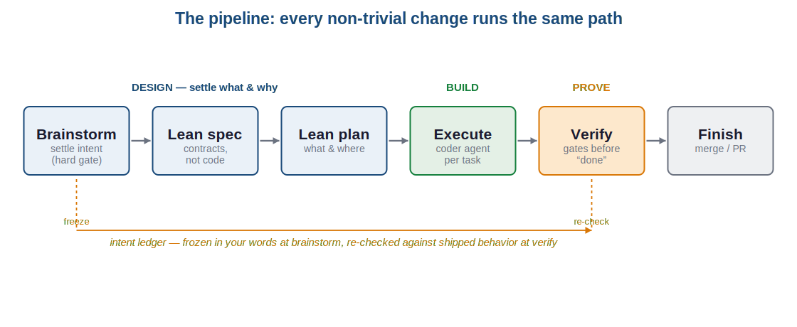
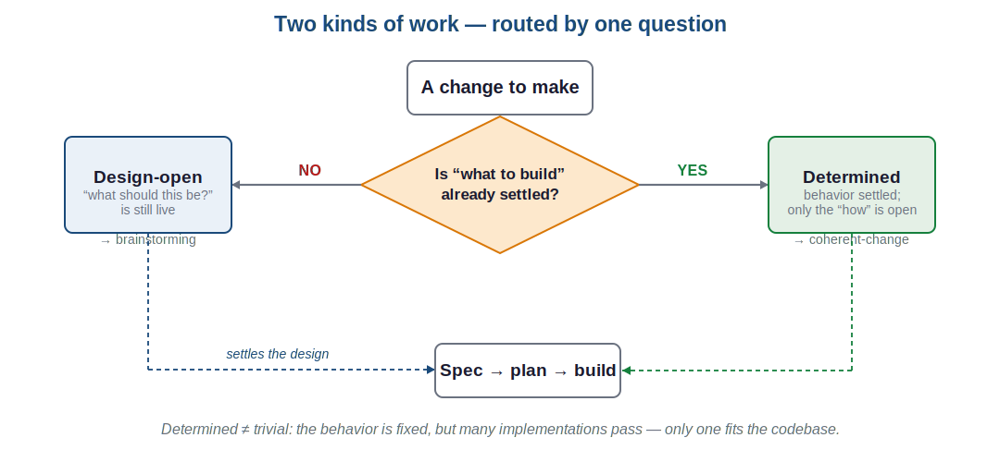
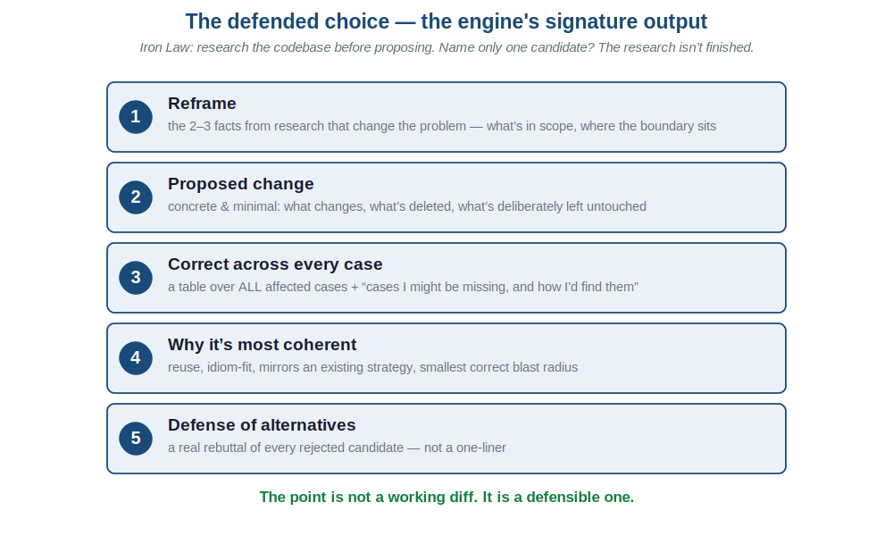
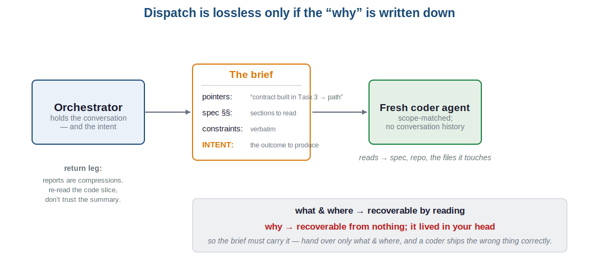
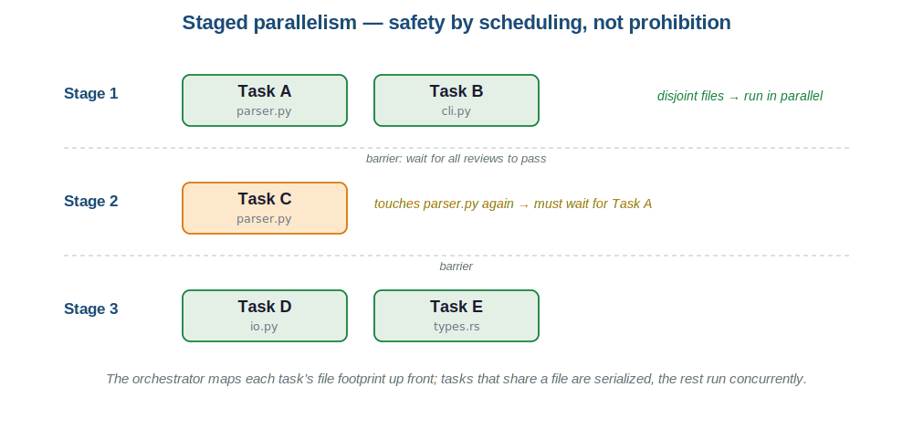
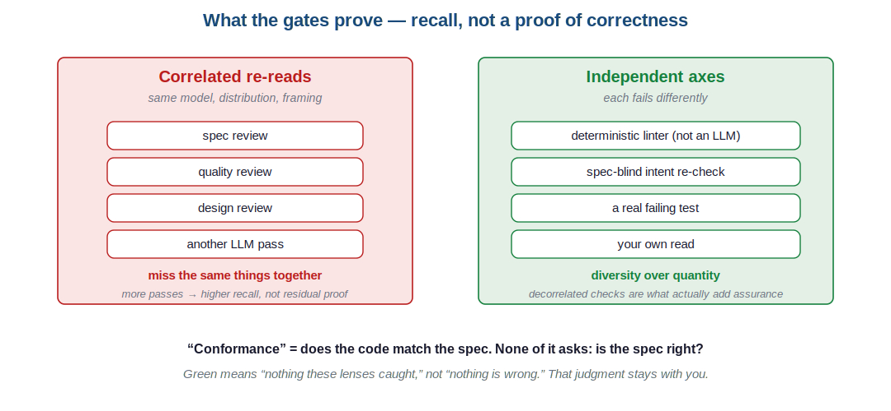
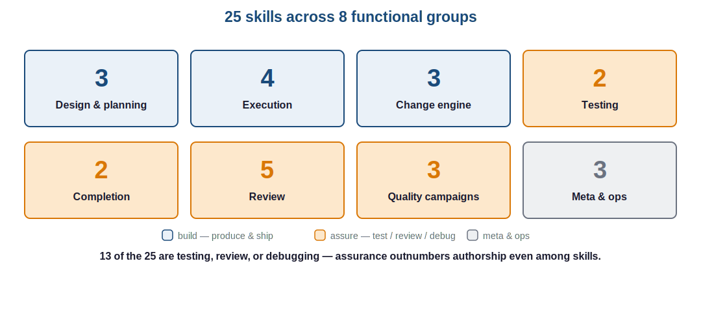
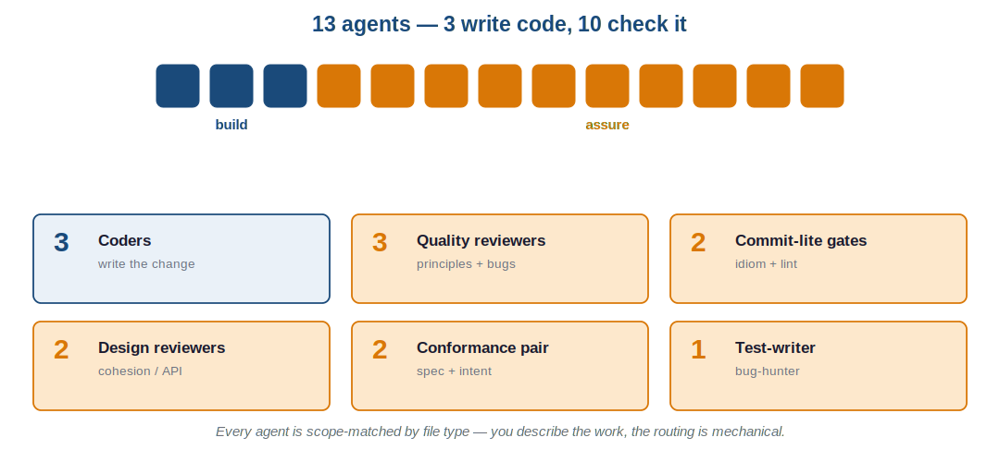
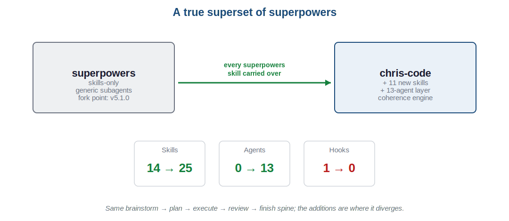
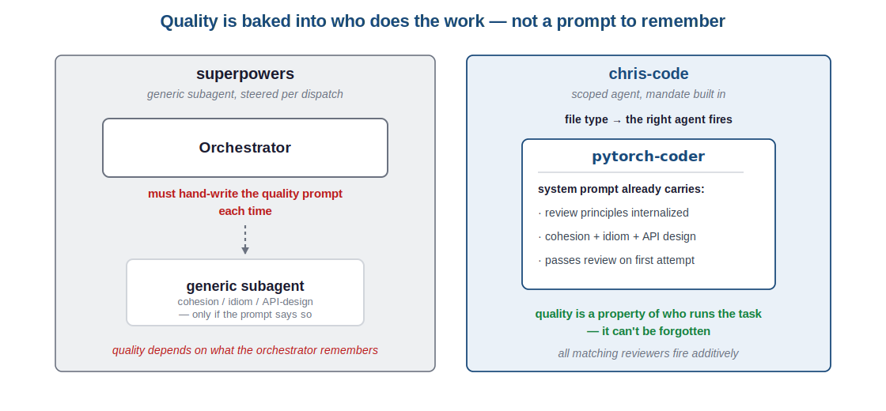

<!-- _class: lead -->

# An introduction to chris-code

## Turning Claude Code from a free-form assistant into an opinionated engineering workflow

For engineers new to the plugin — what it is, why it's shaped this way, and how a change moves through it

*chris-code · intro deck*

---

## The starting problem

A free-form coding assistant starts typing immediately.

- That's fine for trivia. It's **fatal for anything with a real design space**: the first approach that compiles becomes the design by default, and the reasoning that would have justified a *better* one never happens.
- Agent-generated changes land **unreviewed** — drift reaches `main` before anyone reads it against what you actually asked for.
- A fresh agent that didn't hear the conversation **reconstructs your intent wrong**, and does it confidently.

> chris-code is a set of skills and agents that impose a fixed engineering workflow on top of Claude Code to close these gaps.

**Term:** a **skill** is a reusable instruction module; an **agent** is a subagent with a defined role (a coder, a reviewer) that runs in its own context.

---

## What chris-code is

It routes every non-trivial change through **one pipeline** instead of ad-hoc chat: **DESIGN** settles *what* and *why*, **BUILD** dispatches a coder per task, **PROVE** gates the result.

**25 skills** and **13 agents**, most auto-dispatched — you describe the work, not the tool.

---

## Principle 1 — design before code

`brainstorming` is a **hard gate**: no implementation begins until a design exists and *you've approved it*. The anti-pattern it explicitly rejects is *"this is too simple to need a design."*

It ends by freezing an **intent ledger**:

- Up to **seven observable acceptance statements**, in *your* words.
- *It* drafts them from the dialogue; **you approve** them.
- Frozen — it changes only by your explicit decision.

**Why a ledger, kept outside the spec?** It's the record of the original ask. Later, a spec-conformance check can elaborate and reframe the design, but it can't quietly redefine what you asked for — the ledger is the fixed reference the final gate checks against.

---

## Principle 2 — two kinds of work

Not everything needs a brainstorm. The pipeline forks on one question.

**Term — a *determined* change:** behavior is already settled (a refactor, a migration, an already-specced feature); the only open question is *which implementation fits*. Determined ≠ trivial.

---

## The coherent-change engine

Determined work runs through `coherent-change`. Its premise: **a change can work and still be wrong.**

- Every candidate that compiles has the *same behavior* — tests can't tell them apart. The difference (a reused helper vs. a reinvented one; a mirrored error convention vs. a third new one) shows up later, when the next reader hits the seam.
- So the coherent implementation is **discovered from the codebase**, not invented. Parallel `Explore` agents inventory the affected paths first.
- **The tell that research isn't done:** you can name only one approach.

> Working ≠ coherent. Shipping the first thing that compiles is how a codebase accretes debt one reasonable-looking diff at a time.

---

## What the engine produces

Not a working diff — a **defensible** one.

---

## Principle 3 — lean artifacts

The design hands off two deliberately thin documents. The rule: **"contracts stay, choreography goes."**

| Artifact | Keeps | Drops |
|----------|-------|-------|
| `lean-spec` | behavior, interfaces, invariants, acceptance criteria | implementation steps |
| `lean-plan` | *what* to do and *where* | *how* — code the agent would rewrite anyway |

**The test:** if a line would change when you reimplement in another language, it's choreography — it belongs in the plan, not the spec; and code belongs in neither.

This isn't just tidiness. A lean spec is the **context-serialization mechanism** that makes the next principle safe.

---

## Principle 4 — dispatch, and the intent channel

Work is offloaded to subagents to keep the **orchestrator** (the main planning session) lean. The rule for when that's safe:

> Dispatch when the task's context is **recoverable from artifacts**. Stay in-session when the *why* lives only in the conversation.

---

## Parallelism without collisions

Independent tasks run concurrently — after the orchestrator maps each task's file footprint to prove they don't collide.

Superpowers calls parallel implementers a *red flag*; chris-code makes parallelism **safe by scheduling**, not prohibition.

---

## Principle 5 — prove it, honestly

chris-code runs many review gates, and is **deliberately honest that green ≠ correct.**

**Term — conformance:** does the code match the spec — distinct from correctness. A build can conform perfectly to a spec that drifted from your ask.

---

## The completion gate

`verification-before-completion` runs five steps in order; a failing step stops the line.

1. **Tests** — full suite, zero failures
2. **Lints** — zero errors or warnings
3. **Design review** — senior `*-design-reviewer` agents → PASS / CONCERNS
4. **Requirements** — every spec item traced to code *and* a test
5. **Intent re-check** — a **spec-blind** `intent-reviewer` compares shipped behavior to your frozen ledger

A **PASS is not "nothing to do":** it can carry findings, and PASS-with-findings is not clean. The one gate that never reads the spec — step 5 — is the one that catches a spec that drifted from the ask.

---

## Zooming out — the surface area

Most of these fire automatically: you describe the work, the pipeline picks the skill.

---

## One coder, ten checkers

The 13 agents split sharply between writing code and checking it — and the split *is* the philosophy.

---

## Lineage — a superset of superpowers

chris-code forked from `obra/superpowers` and kept the whole pipeline. Every superpowers skill is still here; the additions are the divergence.

---

## The dispatch difference — the part most easily missed

superpowers steers a *generic* subagent per call, so quality depends on the orchestrator remembering to ask. chris-code's agents carry that mandate in their own system prompt.

---

## When to use it (and when not)

**Reach for chris-code when:**

- The change is substantial enough to **deserve a design and a review**.
- You want intent settled before code, and drift caught before `main`.
- You work in **Python or Rust** (coder and review agents are language-scoped; the workflow skills are language-agnostic).

**Skip it when:** you just want a quick one-off answer. It earns its keep on real changes, not trivia.

---

## Recap — five ideas

1. **Design before code.** `brainstorming` is a hard gate; intent is frozen in your words.
2. **Determined ≠ design-open.** Settled behavior routes to the `coherent-change` engine, which *defends* its choice.
3. **Lean artifacts.** Contracts stay, choreography goes — which is what makes dispatch lossless.
4. **Dispatch by scope, carry intent.** A fresh agent recovers *what* and *where* by reading; the brief must carry the *why*.
5. **Green ≠ correct.** Assurance comes from the *independent* checks — the linter, a spec-blind intent re-check, real tests, your own read.

> Design it, defend it, dispatch it, prove it.

*Docs: the chris-code site → Explanation section. Start: `/brainstorming`.*
