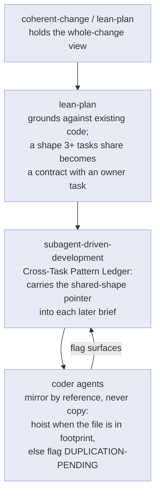

# Coherent change

Most engineering is not design-open. The behavior is already settled and the only real question is *which implementation fits* — a refactor, a migration, an API alignment, a bug with a known cause, an already-specced feature. chris-code routes all of it through one engine, `coherent-change`, and this page is about the idea that engine defends: that a change can work and still be wrong, and that fitting the codebase is a property you have to *prove*, not a side effect of the tests passing.

## Working is not coherent

A determined change is not a trivial one. "Settled behavior" narrows *what* to build, but it leaves the whole space of *how* wide open, and the implementations in that space are not interchangeable. One reuses a helper the codebase already has; another reimplements it. One mirrors the error strategy of its neighbors; another invents a third convention. All of them go green. The difference never shows up in a test run, because tests check behavior, and every candidate has the same behavior. It shows up later, when the next reader hits the seam the wrong-but-working version left behind.

That is the cost model the engine is built around. The first approach that compiles is a *candidate*, never a conclusion. Shipping it is how a codebase accretes debt one reasonable-looking diff at a time, and no single diff ever looks like the problem.

## The implementation is discovered, not invented

The engine's central move is to treat the coherent implementation as something *already latent in the codebase* rather than something you author. If the project already solves this class of problem somewhere, the coherent change is the one that mirrors that solution, and finding it is an act of research, not invention. This is why the load-bearing stage is not writing but reading: parallel `Explore` agents inventory every producer and consumer of the thing you're changing, how the affected path works end to end, and the repo's existing idiom for this kind of change.

The tell that the research isn't finished is simple: **if you can name only one approach, you haven't looked hard enough.** A single candidate means you invented rather than discovered. Two to four candidates, each cited to a concrete precedent in the code, means you actually surveyed how the codebase already thinks.

## The defended choice is an epistemic device

The engine's signature output is a **defended choice**, and its structure is not bureaucracy — each part exists to close a specific way of being wrong. The [pipeline page](the-pipeline.md#the-determined-change-engine) lists the parts; what matters here is *why* they earn trust:

- The **correctness table** ranges over *every* case the change touches, not the one you were thinking about, and it carries a required "cases I might be missing, and how I'd find them" line. That line is the difference between proving coverage and asserting it: it names where you searched for siblings and inputs, so an omission is visible instead of silent. A change that closes the happy path and leaves a sibling branch broken is the exact incoherence this catches.
- The **defense of alternatives** forces the rejected candidates to get a real rebuttal, not a dismissal. You cannot write "less coherent" and move on; you have to say *why* — non-exhaustive, over-reaching, paradigm-violating. A choice defended against its alternatives is trustworthy in a way a choice presented alone never is, because the reasoning that rejected the others is on the page where a reviewer can check it.

The point of the whole ritual is not a working diff. It is a *defensible* one.

## Coherence has to survive decomposition

A single coherent edit is easy to keep coherent: one actor holds the whole change in view. The hard case is the **major** determined change, which is settled design and therefore routes like any design does — to `lean-spec`, then `lean-plan`, then `subagent-driven-development`, fanned out across parallel coder agents. The moment a change is decomposed, the whole-change view that made it coherent is gone: each coder sees only its own task, in its own fresh context, and none of them can see that four sibling tasks are all about to write the same block.

That is a real failure mode, not a hypothetical — it is how the same logic lands as nine near-identical copies, with every per-task review passing, because no reviewer ever sees more than one diff. Coherence at the single-edit altitude does not automatically survive the fan-out. It has to be *carried*, and a recent chain of changes is what carries it:

Each link answers the question the next actor can't answer alone. `lean-plan` grounds against existing code *before* decomposing, so a shape several tasks will share is named as a contract with one owner rather than left inline to be copied N times. The **pattern ledger** in `subagent-driven-development` is the orchestrator's memory of those shapes across tasks — it is the only actor that sees the sequence, so it carries the "call this, don't re-inline it" pointer into each later brief. And the coder agents are told to **mirror by reference**: if a task needs a block a sibling already wrote, hoist it when the owning file is already in the task's footprint, and otherwise flag `DUPLICATION-PENDING` so the orchestrator assigns the hoist rather than letting the copy ride to the commit.

The through-line: coherence is not a one-time check at the end. It is a property established when the change is a whole, and then *preserved* down through every altitude that pulls the change apart.

## Where coherence is enforced

| Altitude | What keeps it coherent |
|----------|------------------------|
| Single edit | The defended choice: research, candidates, correctness table, defense of alternatives |
| Plan | `lean-plan` grounds against existing code; repeated shapes become contracts with owners |
| Execution | The Cross-Task Pattern Ledger carries shared-shape pointers between tasks |
| Coder | Mirror-by-reference; `DUPLICATION-PENDING` when a hoist is out of the task's footprint |

## Change fully, defer only the separable

The discipline that keeps all of this honest is that a determined change **closes its whole scope** — every sibling branch, producer, and input its intent reaches. No stubs, no silent fallbacks, no "handle the rest later." The test is whether a reader would call the change fully done. "Mostly, except the siblings" is banned deferral; "yes, and there's a bigger orthogonal refactor for someday" is a legitimate follow-up. That boundary is developed further on [the pipeline page](the-pipeline.md#change-fully-defer-only-the-separable).

For the task-oriented version of this — the actual steps of invoking the engine — see [Make a determined change](../how-to/make-a-determined-change.md).
