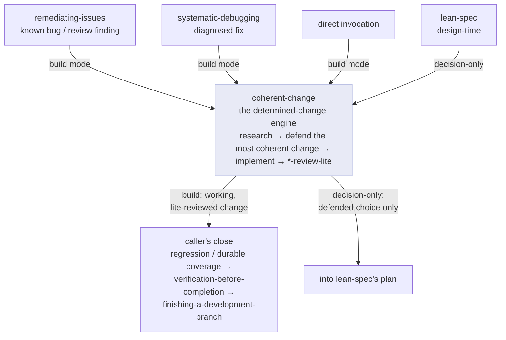

# The pipeline

## Why design before code

A free-form coding assistant starts typing immediately. That's fine for trivia and fatal for anything with a real design space: the first approach that compiles becomes the design by default, and the reasoning that would have justified a *better* approach never happens. chris-code inverts this. `brainstorming` is a hard gate — no implementation begins until a design exists and you've approved it. The design can be short, but it must exist, and the anti-pattern it explicitly rejects is *"this is too simple to need a design."*

## Lean artifacts

The artifacts that follow are deliberately lean, and that's a reaction to a real failure mode. superpowers' plans documented everything "as if the engineer has zero context," with complete code in every step — which implementing agents then discarded and rewrote, so the effort was wasted and the plan-vs-reality mismatch caused confusion.

chris-code's rule is **"contracts stay, choreography goes."** A `lean-spec` records only what survives a rewrite — system behavior, interfaces, invariants, acceptance criteria — and a `lean-plan` says *what* and *where*, trusting the executor to write code against the real repository. The test is concrete: if a line would change when you reimplement in another language, it's choreography and belongs in the plan, not the spec. A word-efficiency principle enforces it — every line must be load-bearing, and length is treated as a smell, not a budget to fill.

This leanness isn't just tidiness; it's what makes dispatch work. See [Context & dispatch](context-and-dispatch.md).

## Two kinds of work

Not everything is design-open. Much engineering is **determined**: the intended behavior is already settled (a bug, a refactor, an API alignment, an already-specced change) and the only open question is *which implementation best fits the codebase*. Forcing that through a full brainstorm is wasteful; shipping the first thing that works is how a codebase accretes debt. chris-code routes determined work through a dedicated engine.

## The determined-change engine

`coherent-change` is the engine for determined work. It runs under an **Iron Law**: no implementation is proposed before the codebase has been researched and alternatives have been weighed. The first approach that works is a candidate, never the conclusion — if you can name only one approach, the research isn't finished.

Its signature output, produced every time, is a **defended choice**, and the structure is the point:

1. **Reframe** — the two or three facts from research that change the problem: what's in scope, what's irrelevant, where the real boundary sits.
2. **Proposed change** — concrete and minimal: what changes, what's deleted, what's deliberately left untouched.
3. **Correct across every affected case** — a table over *all* cases the change touches (not just the obvious one), showing it's right for each and that already-correct cases stay unchanged, plus a "cases I might be missing, and how I'd find them" line.
4. **Why it's the most coherent choice** — reuse, idiom-fit, whether it mirrors an existing strategy, contract-preservation, smallest correct blast radius.
5. **Defense against the alternatives** — a real rebuttal of each rejected candidate, not a one-liner.

The point is not a working diff — it's a *defensible* one. The defended choice is what makes the change trustworthy and reviewable.

It is rarely invoked alone. Front-ends own the *framing* and the *close* and delegate the *build* to it:

Two modes turn on one question — *does a downstream workflow own implementation?* In **build mode** (the default), the engine implements via a coder agent, runs its `*-review-lite` self-gate, and hands back a working change; the caller owns the heavyweight close. In **decision-only mode**, it stops after the defended choice, because `lean-spec` owns implementation itself.

## Change fully, defer only the separable

The discipline that keeps the engine honest: a determined change **closes its whole scope** — every sibling branch, producer, and input its intent reaches (the correctness table lists them). No stubs, no silent fallbacks, no "handle the rest in a later phase." Partial coverage dressed as done is exactly the incoherence the engine exists to prevent.

This isn't a ban on follow-ups. The line is: *would a reader consider this change fully done?* "Mostly, except the siblings / a stub / a fallback" is banned deferral. "Yes, and there's a bigger orthogonal refactor for someday" is a legitimate follow-up — the right-but-disproportionate north-star is logged and deferred, because the current change already closes its scope without it.
