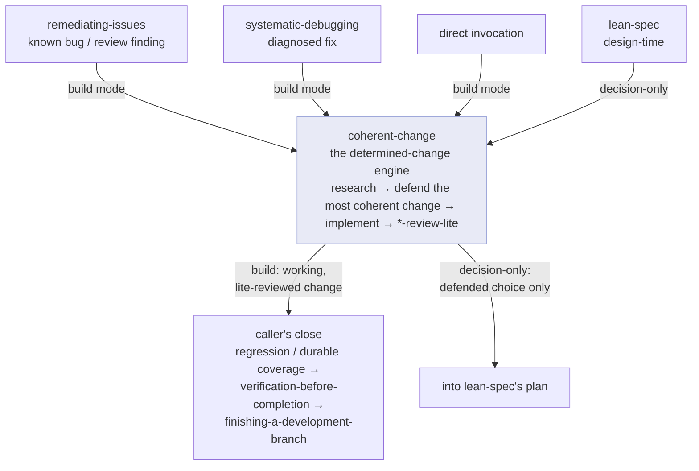

# The pipeline

## Why design before code

A free-form coding assistant starts typing immediately. That's fine for trivia and fatal for anything with a real design space: the first approach that compiles becomes the design by default, and the reasoning that would have justified a *better* approach never happens. chris-code inverts this. `brainstorming` is a hard gate — no implementation begins until a design exists and you've approved it. The design can be short, but it must exist.

The artifacts that follow are deliberately lean. A `lean-spec` records only the contracts that survive a rewrite — invariants, interfaces, acceptance criteria — not a coding walkthrough. A `lean-plan` says *what* and *where*, and trusts the executor to write code against the real repository. The guiding rule is **"contracts stay, choreography goes"**: anything that would change if you reimplemented in another language belongs in a plan, not a spec.

## Two kinds of work

Not everything is design-open. Much engineering is **determined**: the intended behavior is already settled (a bug, a refactor, an API alignment, an already-specced change) and the only open question is *which implementation best fits the codebase*. Forcing that through a full brainstorm is wasteful; shipping the first thing that works is how a codebase accretes debt. chris-code routes determined work through a dedicated engine.

## The determined-change engine

`coherent-change` is the engine for determined work. Its signature output, produced every time, is a **defended choice**: every genuine candidate rooted in how the codebase already solves the problem, the one selected, proof it's correct across *all* affected cases, and why it beats the alternatives on reuse, idiom-fit, contract-preservation, and least surprise. The point is not a working diff — it's a *defensible* one.

It is rarely invoked alone. Front-ends own the *framing* and the *close* and delegate the *build* to it:

Two modes turn on one question — *does a downstream workflow own implementation?* In **build mode** (the default), the engine implements via a coder agent, runs its `*-review-lite` self-gate, and hands back a working change; the caller owns the heavyweight close. In **decision-only mode**, it stops after the defended choice, because `lean-spec` owns implementation itself.

The discipline that keeps the engine honest: a determined change **closes its whole scope** — every sibling branch, producer, and input its intent reaches. No stubs, no "handle the rest later"; only a genuinely separate, larger improvement is deferred.
