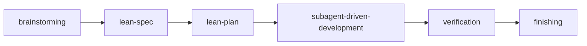
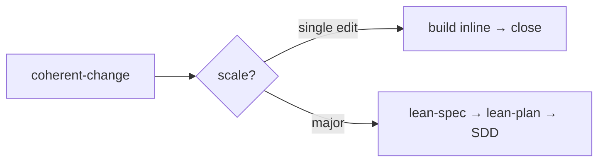
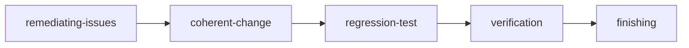
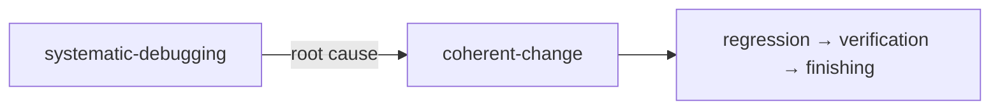
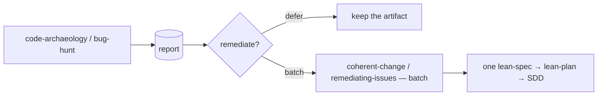
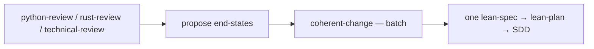
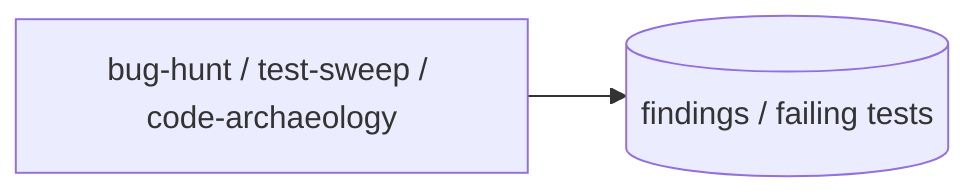
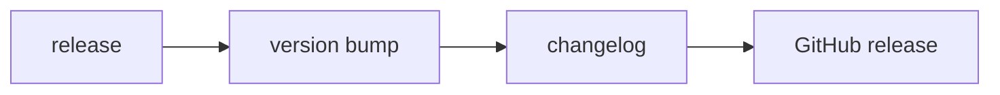

# How-to: choose your workflow

Pick the route that matches your situation. Each is a canonical chris-code workflow — a graph of the skills it chains, when to reach for it, and how to start. Follow the link for the step-by-step recipe, or the *why* link for the design rationale.

All routes converge on the same engines: design-open work runs the **pipeline**; everything with a settled end-state runs through **`coherent-change`** (which finds the method and sizes the change); discovery skills *propose* and hand off, they never apply.

---

## Build a new feature

**Use when** *what to build* is still open — a feature, a new subsystem, anything design-first.

**Start:** `/brainstorming` (or just describe the feature). → [recipe](build-a-feature.md) · [why](../explanation/the-pipeline.md)

---

## Make a determined change

**Use when** the behavior is settled and only the *implementation* is open — a refactor, migration, or API alignment.

**Start:** `/coherent-change`. → [recipe](make-a-determined-change.md) · [why](../explanation/the-pipeline.md#the-determined-change-engine)

---

## Fix a bug — cause known

**Use when** you have a known defect (a tracked issue, a review finding) with more than one plausible fix.

**Start:** `/remediating-issues`. → [recipe](remediate-a-bug.md)

---

## Fix a bug — cause unknown

**Use when** something fails unexpectedly and you don't yet know why — never patch before the root cause is found.

**Start:** `/systematic-debugging`. → [recipe](debug-unknown-cause.md)

---

## Remediate a sweeping audit

**Use when** an audit has surfaced many findings at once (`code-archaeology`'s gaps/stubs, `bug-hunt`'s edge-case bugs).

**Start:** `/code-archaeology` or `/bug-hunt`; accept the remediation offer to batch. → [recipe](remediate-in-batch.md)

---

## Remediate a sweeping review

**Use when** a senior review has proposed many changes across a subsystem (`python-review`, `rust-review`, `technical-review`).

**Start:** `/python-review` (etc.); the review proposes, then routes the set to the engine. → [recipe](remediate-in-batch.md) · single ad-hoc review → [review a branch](review-a-branch.md)

---

## Run a quality campaign

**Use when** you want to go hunting proactively — find bugs, sweep the API surface, or surface unfinished work.

**Start:** `/bug-hunt`, `/test-sweep`, or `/code-archaeology`; findings feed the batch-remediation route above. → [recipe](run-a-quality-campaign.md)

---

## Cut a release

**Use when** you're publishing a new version.

**Start:** `/release`. → [recipe](cut-a-release.md)

---

For the full list of skills and what triggers them, see the [Skills reference](../reference/skills.md). For *why* the routes are shaped this way, see [Explanation](../explanation/index.md).
