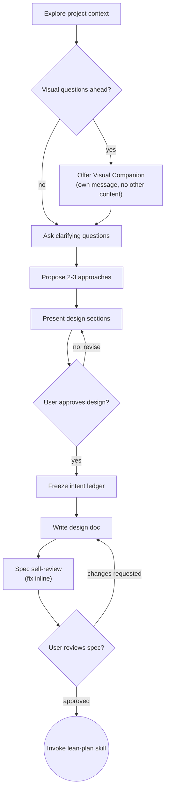

# Brainstorming Ideas Into Designs

Help turn ideas into fully formed designs and specs through natural collaborative dialogue.

Start by understanding the current project context, then ask questions one at a time to refine the idea. Once you understand what you're building, present the design and get user approval.

<HARD-GATE>
Do NOT invoke any implementation skill, write any code, scaffold any project, or take any implementation action until you have presented a design and the user has approved it. This applies to EVERY project regardless of perceived simplicity.
</HARD-GATE>

## Anti-Pattern: "This Is Too Simple To Need A Design"

The design can be short (a few sentences for simple projects), but it must exist and be approved.

## Checklist

You MUST create a task for each of these items and complete them in order:

1. **Explore project context** — check files, docs, recent commits
2. **Offer visual companion** (if topic will involve visual questions) — this is its own message, not combined with a clarifying question. See the Visual Companion section below.
3. **Ask clarifying questions** — one at a time, understand purpose/constraints/success criteria
4. **Propose 2-3 approaches** — with trade-offs and your recommendation
5. **Present design** — in sections scaled to their complexity, get user approval after each section
6. **Spec readiness check** — read `lean-spec`'s output structure (sections 1–10) and verify you have enough context to fill each one. If gaps exist, ask the remaining questions before proceeding.
7. **Freeze the intent ledger** — *you* draft ≤7 observable acceptance statements from the dialogue you just had (quoting the user), the user confirms or tweaks, then save to `.claude/output/intent/YYYY-MM-DD-<topic>-intent.md` (see The Intent Ledger below)
8. **Write spec** — invoke `lean-spec` skill, save to `.claude/output/specs/YYYY-MM-DD-<topic>-design.md` and commit
9. **Spec self-review** — quick inline check for placeholders, contradictions, ambiguity, scope (see below)
10. **User reviews written spec** — ask user to review the spec file before proceeding
11. **Transition to implementation** — invoke `lean-plan` skill to create implementation plan

## Process Flow

**The terminal state is invoking lean-plan.** Do NOT invoke any other implementation skill. The ONLY skill you invoke after brainstorming is lean-plan.

## The Process

**Understanding the idea:**

- Check out the current project state first (files, docs, recent commits)
- Before asking detailed questions, assess scope: if the request describes multiple independent subsystems (e.g., "build a platform with chat, file storage, billing, and analytics"), flag this immediately. Don't spend questions refining details of a project that needs to be decomposed first.
- If the project is too large for a single spec, help the user decompose into sub-projects: what are the independent pieces, how do they relate, what order should they be built? Then brainstorm the first sub-project through the normal design flow. Each sub-project gets its own spec → plan → implementation cycle.
- For appropriately-scoped projects, ask questions one at a time to refine the idea
- Prefer multiple choice questions when possible, but open-ended is fine too
- Only one question per message - if a topic needs more exploration, break it into multiple questions
- Focus on understanding: purpose, constraints, success criteria

**Exploring approaches:**

- Propose 2-3 different approaches with trade-offs
- Present options conversationally with your recommendation and reasoning
- Lead with your recommended option and explain why

**Presenting the design:**

- Once you believe you understand what you're building, present the design
- Scale each section to its complexity: a few sentences if straightforward, up to 200-300 words if nuanced
- Ask after each section whether it looks right so far
- Cover: architecture, components, data flow, error handling, testing
- Be ready to go back and clarify if something doesn't make sense

**Design for isolation and clarity:**

- Break the system into units with one clear purpose, well-defined interfaces, and independent testability
- Each unit should be understandable without reading its internals, and changeable without breaking consumers
- When a file grows large, that's a signal it's doing too much

**Working in existing codebases:**

- Explore the current structure before proposing changes. Follow existing patterns.
- Where existing code has problems that affect the work (e.g., a file that's grown too large, unclear boundaries, tangled responsibilities), include targeted improvements as part of the design - the way a good developer improves code they're working in.
- Don't propose unrelated refactoring. Stay focused on what serves the current goal.

## The Intent Ledger

Before the spec is written, freeze a small record of what the user actually asked for — in their words, not the spec's. The spec will elaborate, reframe, and add structure; the ledger stays as the original ask, so a later gate can check shipped behavior against intent without the spec's framing standing in the way.

**You write it, not the user.** The brainstorming dialogue has already surfaced the intent; this step just crystallizes it. Draft the statements yourself from what the user said, then present them for a quick confirm-or-adjust — the same lightweight gate as design approval, not a separate authoring task handed back to the user. Do not ask the user to compose the statements.

- **Content:** ≤7 observable acceptance statements — outcomes you could watch the running system produce and judge met-or-not. Quote the user where you can. Not implementation steps, not design decisions.
- **Approval:** present your draft and get a quick sign-off (the user may edit). The ledger is the user's record, but the drafting work is yours.
- **Frozen:** once approved it changes only by explicit user decision — never edited to match what the spec or the implementation later turned out to be. Drift in the ledger defeats its purpose.
- **Location:** `.claude/output/intent/YYYY-MM-DD-<topic>-intent.md`.

This is the oracle the `intent-reviewer` reads at the verification gate (`verification-before-completion` Step 5). It deliberately lives outside the spec: it is the one artifact a spec-conformance check cannot quietly redefine.

## After the Design

**Documentation:**

- Invoke `lean-spec` to write the validated design to `.claude/output/specs/YYYY-MM-DD-<topic>-design.md`
- Commit the design document to git

**Spec Self-Review:**
After writing the spec, scan for: TBDs/TODOs, internal contradictions, scope creep, ambiguous requirements. Fix inline.

**User Review Gate:**
Ask the user to review the written spec before proceeding. Wait for approval. Only then invoke `lean-plan`.

## Key Principles

- **One question at a time** - Don't overwhelm with multiple questions
- **Multiple choice preferred** - Easier to answer than open-ended when possible
- **YAGNI ruthlessly** - Remove unnecessary features from all designs
- **Explore alternatives** - Always propose 2-3 approaches before settling
- **Incremental validation** - Present design, get approval before moving on
- **Be flexible** - Go back and clarify when something doesn't make sense

## Visual Companion

A browser-based companion for showing mockups, diagrams, and visual options during brainstorming. Available as a tool — not a mode. Accepting the companion means it's available for questions that benefit from visual treatment; it does NOT mean every question goes through the browser.

**Offering the companion:** When you anticipate that upcoming questions will involve visual content (mockups, layouts, diagrams), offer it once for consent:
> "Some of what we're working on might be easier to explain if I can show it to you in a web browser. I can put together mockups, diagrams, comparisons, and other visuals as we go. This feature is still new and can be token-intensive. Want to try it? (Requires opening a local URL)"

**This offer MUST be its own message.** Do not combine it with clarifying questions, context summaries, or any other content. The message should contain ONLY the offer above and nothing else. Wait for the user's response before continuing. If they decline, proceed with text-only brainstorming.

**Per-question decision:** Even after the user accepts, decide FOR EACH QUESTION whether to use the browser or the terminal. The test: **would the user understand this better by seeing it than reading it?**

- **Use the browser** for content that IS visual — mockups, wireframes, layout comparisons, architecture diagrams, side-by-side visual designs
- **Use the terminal** for content that is text — requirements questions, conceptual choices, tradeoff lists, A/B/C/D text options, scope decisions

A question about a UI topic is not automatically a visual question. "What does personality mean in this context?" is a conceptual question — use the terminal. "Which wizard layout works better?" is a visual question — use the browser.

If they agree to the companion, read the detailed guide before proceeding:
`skills/brainstorming/visual-companion.md`
