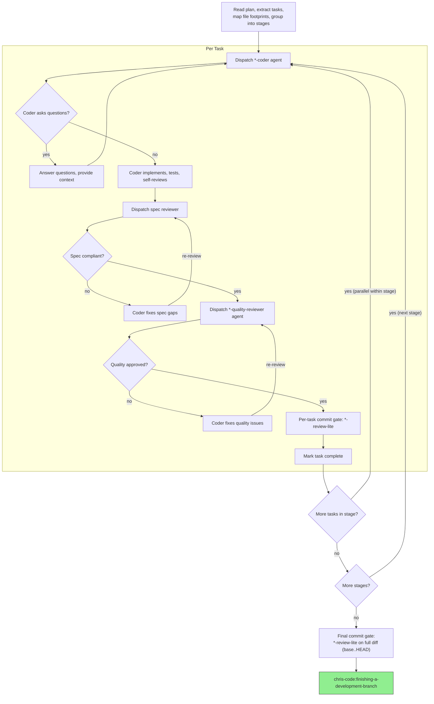

# Subagent-Driven Development

Execute plan by dispatching fresh subagent per task, with two-stage review after each: spec compliance review first, then code quality review.

**Core principle:** Specialized coder agent per task → spec review → quality review → commit gate. Fresh context per task, staged parallelism for independent tasks.

**Continuous execution:** Do not pause between tasks. The only reasons to stop: unresolvable BLOCKED status, ambiguity that prevents progress, or all tasks complete.

**Every task gets every gate.** The three-stage review (spec → quality → review-lite) applies to ALL tasks — not just the first one. You will feel pressure to skip gates on later tasks because "the pattern is established" or "this one is simple." That impulse is the exact failure mode this rule prevents. Task 5 gets the same gates as Task 1. No exceptions.

## The Process



## Agent Selection

### Coder Agents (exclusive — one coder per task)

Dispatch the most specific `*-coder` agent for the task's file types:

1. Check which file types the task will touch
2. Match against available `*-coder` agents by `scope.extensions`
3. If multiple match the same extension, resolve via `scope.require_dependencies` — most specific wins (e.g., `pytorch-coder` over `python-coder` when project depends on torch)
4. Concrete tiebreaker: if the code subclasses `nn.Module`, manipulates `torch.Tensor` shapes/devices, or implements a training-pipeline component (loss, callback, optimizer, scheduler, metric), dispatch `pytorch-coder`. Reserve `python-coder` for non-torch code (CLI, data I/O, config utils).
5. If no specific coder matches, fall back to a general-purpose agent

Only one coder agent writes the code. The winning coder must be self-contained (includes both domain-specific and general language patterns).

### Review Agents (additive — all matching agents fire)

Unlike coders, `*-quality-reviewer` and `*-review-lite` agents are **additive**: all agents matching the file extensions fire on the same diff. In a PyTorch project, `.py` files get both `python-quality-reviewer` (general Python patterns) and `pytorch-quality-reviewer` (Lightning conventions, training correctness). If findings conflict, the more specific agent's guidance takes precedence.

### Model Selection

Use the least powerful model that can handle each role. **Announce the model and agent on every dispatch:**
- "Dispatching haiku python-coder agent for Task 3 (add utility function)"
- "Dispatching sonnet rust-coder agent for Task 5 (refactor pipeline)"
- "Dispatching opus general agent for final cross-cutting review"

| Model | When |
|-------|------|
| **Haiku** | Isolated functions, clear spec, 1–2 files, mechanical changes |
| **Sonnet** | Multi-file coordination, integration concerns, pattern matching |
| **Opus** | Architecture decisions, design judgment, broad codebase understanding, reviews |

## Task Scheduling

Use **staged parallelism**, not flat sequential or flat parallel dispatch.

1. **Map file footprints:** Before dispatching, identify every source file and test file each task will touch
2. **Group into stages:** Tasks within a stage must have zero file overlap (source AND test files). Tasks that share any file go in separate stages.
3. **Within a stage:** Dispatch subagents in parallel — they touch disjoint files and cannot conflict
4. **Between stages:** Wait for all tasks in the current stage to complete and pass review before starting the next stage

Common serialization triggers:
- Two tasks both modify the same test file (e.g., `conftest.py`, `test_utils.py`)
- Two tasks both touch a shared module (e.g., `models.py`, `lib.rs`)
- A later task depends on types/interfaces introduced by an earlier task

When in doubt, serialize. The cost of a conflict is higher than the cost of waiting.

## Handling Implementer Status

Implementer subagents report one of four statuses. Handle each appropriately:

**DONE:** Proceed to spec compliance review.

**DONE_WITH_CONCERNS:** The implementer completed the work but flagged doubts. Read the concerns before proceeding. If the concerns are about correctness or scope, address them before review. If they're observations (e.g., "this file is getting large"), note them and proceed to review.

**NEEDS_CONTEXT:** The implementer needs information that wasn't provided. Provide the missing context and re-dispatch.

**BLOCKED:** The implementer cannot complete the task. Assess the blocker:
1. If it's a context problem, provide more context and re-dispatch with the same model
2. If the task requires more reasoning, re-dispatch with a more capable model
3. If the task is too large, break it into smaller pieces
4. If the plan itself is wrong, escalate to the human

**Never** ignore an escalation or force the same model to retry without changes. If the implementer said it's stuck, something needs to change.

## Prompt Templates

- `./implementer-prompt.md` - Dispatch implementer subagent (used when no `*-coder` agent matches)
- `./spec-reviewer-prompt.md` - Dispatch spec compliance reviewer subagent

Quality review is handled by `*-quality-reviewer` agents (e.g., `python-quality-reviewer`, `rust-quality-reviewer`), dispatched by scope matching — no prompt template needed.

## Example Workflow

```
[Read plan: .claude/output/plans/feature-plan.md]
[Extract 5 tasks, map file footprints, group into 3 stages]
[Stage 1: Tasks 1,2 (disjoint files) | Stage 2: Task 3 | Stage 3: Tasks 4,5 (disjoint)]

Stage 1 — dispatching 2 tasks in parallel:
  "Dispatching sonnet python-coder agent for Task 1 (add CLI hook)"
  "Dispatching haiku python-coder agent for Task 2 (add utility function)"

  Task 1: coder completes → spec reviewer ✅ → quality reviewer ❌ (S3: hidden side effect
    in helper) → coder fixes → quality reviewer ✅ → python-review-lite ✅ → mark complete
  Task 2: coder completes → spec reviewer ✅ → quality reviewer ✅ → python-review-lite ✅
    → mark complete

Stage 2:
  "Dispatching sonnet python-coder agent for Task 3 (refactor shared module)"
  [Task 3 shares conftest.py with Tasks 1,2 — must wait for Stage 1]

  Task 3: coder completes → reviews pass → commit gate → mark complete

Stage 3 — dispatching 2 tasks in parallel:
  "Dispatching sonnet rust-coder agent for Task 4 (add FFI binding)"
  "Dispatching haiku python-coder agent for Task 5 (add Python wrapper)"

  [Both complete → reviews → commit gates (rust-review-lite + python-review-lite) → mark complete]

[Final commit gate: python-review-lite + rust-review-lite on full diff (base..HEAD)]
[chris-code:finishing-a-development-branch]
```

## Red Flags

- Never start implementation on main/master without explicit user consent
- Never skip reviews (spec compliance OR quality) or proceed with unfixed issues
- Never dispatch subagents in parallel when their file footprints overlap
- Never make a subagent read the plan file — provide full task text in the prompt
- Never start quality review before spec compliance passes
- Never move to next task while any review has open issues
- If a reviewer finds issues: coder fixes → reviewer re-reviews → repeat until approved
- If a subagent is blocked: provide more context, upgrade model, or break the task apart — never force retry without changes

## Integration

**Required workflow skills:**
- **chris-code:using-git-worktrees** - Ensures isolated workspace
- **chris-code:lean-plan** - Creates the plan this skill executes
- **chris-code:requesting-code-review** - Code review template for reviewer subagents
- **chris-code:finishing-a-development-branch** - Complete development after all tasks

**Agents:**
- **`*-coder` agents** - Specialized implementers, auto-dispatched by file type
- **`*-quality-reviewer` agents** - Design quality + bug detection review, auto-dispatched by file type
- **`*-review-lite` agents** - Commit gates (idiom + lint), auto-dispatched by file type

**Subagents should use:**
- **chris-code:test-driven-development** - Subagents follow TDD for each task

**Alternative workflow:**
- **chris-code:executing-plans** - Use for inline execution without subagents
