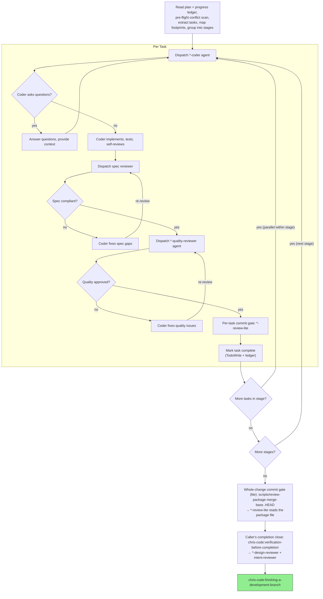

# Subagent-Driven Development

Execute plan by dispatching fresh subagent per task, with two-stage review after each: spec compliance review first, then code quality review.

**Core principle:** Specialized coder agent per task → spec review → quality review → commit gate. Fresh context per task, staged parallelism for independent tasks.

**Continuous execution:** Do not pause between tasks. The only reasons to stop: unresolvable BLOCKED status, ambiguity that prevents progress, or all tasks complete.

**Every task gets every gate.** The three-stage review (spec → quality → review-lite) applies to ALL tasks — not just the first one. You will feel pressure to skip gates on later tasks because "the pattern is established" or "this one is simple." That impulse is the exact failure mode this rule prevents. Task 5 gets the same gates as Task 1. No exceptions.

## Pre-Flight Plan Review

Before dispatching Task 1, load the progress ledger (see Durable Progress) and resume at the first task not marked complete. Then read the plan once and check for:

- **Internal conflicts** — tasks that contradict each other or the plan's Constraints.
- **Plan-mandated defects** — anything the plan asks for that a reviewer would flag (a test that asserts nothing, verbatim duplication, a swallowed error).

Present everything you find to the user as one batched question, each finding beside the plan text that mandates it, asking which governs. If the scan is clean, proceed without comment. Do not interrupt per-discovery mid-run.

## The Process


```mermaid
flowchart TB
    subgraph Per Task
        coder["Dispatch *-coder agent"]
        questions{"Coder asks questions?"}
        answer["Answer questions, provide context"]
        implement["Coder implements, tests, self-reviews"]
        spec_rev["Dispatch spec reviewer"]
        spec_ok{"Spec compliant?"}
        fix_spec["Coder fixes spec gaps"]
        quality_rev["Dispatch *-quality-reviewer agent"]
        quality_ok{"Quality approved?"}
        fix_quality["Coder fixes quality issues"]
        commit_gate["Per-task commit gate: *-review-lite"]
        done["Mark task complete<br/>(TodoWrite + ledger)"]
    end

    read["Read plan + progress ledger,<br/>pre-flight conflict scan,<br/>extract tasks, map footprints, group into stages"]
    more_tasks{"More tasks in stage?"}
    more_stages{"More stages?"}
    final_gate["Whole-change commit gate (lite): scripts/review-package merge-base..HEAD<br/>→ *-review-lite reads the package file"]
    verification["Caller's completion close: chris-code:verification-before-completion<br/>→ *-design-reviewer + intent-reviewer"]
    finish["chris-code:finishing-a-development-branch"]:::finish

    read --> coder
    coder --> questions
    questions -->|yes| answer
    answer --> coder
    questions -->|no| implement
    implement --> spec_rev
    spec_rev --> spec_ok
    spec_ok -->|no| fix_spec
    fix_spec -->|re-review| spec_rev
    spec_ok -->|yes| quality_rev
    quality_rev --> quality_ok
    quality_ok -->|no| fix_quality
    fix_quality -->|re-review| quality_rev
    quality_ok -->|yes| commit_gate
    commit_gate --> done
    done --> more_tasks
    more_tasks -->|"yes (parallel within stage)"| coder
    more_tasks -->|no| more_stages
    more_stages -->|"yes (next stage)"| coder
    more_stages -->|no| final_gate
    final_gate --> verification
    verification --> finish

    classDef finish fill:#90EE90,stroke:#333
```

## Agent Selection

### Coder Agents (exclusive — one coder per task)

Dispatch the most specific `*-coder` agent for the task's file types:

1. Check which file types the task will touch
2. Match against available `*-coder` agents by `scope.extensions`
3. If multiple match the same extension, resolve via `scope.require_dependencies` — most specific wins (e.g., `pytorch-coder` over `python-coder` when project depends on torch)
4. Concrete tiebreaker: if the code subclasses `nn.Module`, manipulates `torch.Tensor` shapes/devices, or implements a training-pipeline component (loss, callback, optimizer, scheduler, metric), dispatch `pytorch-coder`. Reserve `python-coder` for non-torch code (CLI, data I/O, config utils).
5. If no specific coder matches, fall back to a general-purpose agent

Only one coder agent writes the code. The winning coder must be self-contained (includes both domain-specific and general language patterns).

### Review Agents (additive — all matching agents fire)

Unlike coders, `*-quality-reviewer` and `*-review-lite` agents are **additive**: all agents matching the file extensions fire on the same diff. In a PyTorch project, `.py` files get both `python-quality-reviewer` (general Python patterns) and `pytorch-quality-reviewer` (Lightning conventions, training correctness). If findings conflict, the more specific agent's guidance takes precedence.

### Model Selection

Use the least powerful model that can handle each role. **Announce the model and agent on every dispatch:**
- "Dispatching haiku python-coder agent for Task 3 (add utility function)"
- "Dispatching sonnet rust-coder agent for Task 5 (refactor pipeline)"
- "Dispatching opus general agent for final cross-cutting review"

| Model | When |
|-------|------|
| **Haiku** | Isolated functions, clear spec, 1–2 files, mechanical changes |
| **Sonnet** | Multi-file coordination, integration concerns, pattern matching |
| **Opus** | Architecture decisions, design judgment, broad codebase understanding, reviews |

## Task Scheduling

Use **staged parallelism**, not flat sequential or flat parallel dispatch.

1. **Map file footprints:** Before dispatching, identify every source file and test file each task will touch
2. **Group into stages:** Tasks within a stage must have zero file overlap (source AND test files). Tasks that share any file go in separate stages.
3. **Within a stage:** Dispatch subagents in parallel — they touch disjoint files and cannot conflict
4. **Between stages:** Wait for all tasks in the current stage to complete and pass review before starting the next stage

Common serialization triggers:
- Two tasks both modify the same test file (e.g., `conftest.py`, `test_utils.py`)
- Two tasks both touch a shared module (e.g., `models.py`, `lib.rs`)
- A later task depends on types/interfaces introduced by an earlier task

When in doubt, serialize. The cost of a conflict is higher than the cost of waiting.

## File Handoffs

Anything you paste into a dispatch — and anything a subagent prints back — stays resident in your context for the rest of the session. Hand artifacts over as files instead, all under one resolved store directory, per-worktree and uncommitted. Resolve it **once**, at the start of the session, and reuse it everywhere:

```
STORE=$(python3 scripts/ledger.py store-dir)
```

`ledger.py store-dir` is the single authority for the store location, and skills reference it instead of restating the derivation: `git rev-parse --git-path sdd` is not reliably absolute by itself (a linked worktree prints an absolute path under `.git/worktrees/<name>/sdd`, while a plain checkout typically prints one relative to the current directory, `.git/sdd`), so `store-dir` resolves it to the correct absolute path either way — agents are forbidden from computing their own paths (see below), so the path you hand them must be correct by construction regardless of which form git returns underneath. Pass `--store "$STORE"` on every `ledger.py`/`task_brief.py` call this session, and build every record path as `$STORE/task-N-<agent-name>.json`. If a worktree-isolated session can't write under the shared checkout's `.git`, override instead — point `STORE` at an in-tree, gitignored directory (e.g. the absolute path of `.claude/sdd` inside your own worktree) via `STORE=$(python3 scripts/ledger.py store-dir --store DIR)`, then use it identically everywhere; every subcommand accepts `--store DIR`.

- **Task brief:** the brief is a *reference sheet*, not a restatement of the spec. Assemble it with `python3 scripts/task_brief.py PLAN_FILE N --intent "..." [--note "..."]... [--spec SPEC_FILE] [--constraints-from PLAN_FILE] --store "$STORE" -o "$STORE/task-N-brief.md"` (repeat `--note` per cross-task note you hold; `--spec` is required only when the task entry contains a §-ref) — the script extracts the plan's task entry (its actions, `Consumes:` pointers, and spec §-references), embeds the intent and notes you pass it, copies the plan's Constraints verbatim when `--constraints-from` is given, and always appends the shared-shapes section (see Cross-Task Pattern Ledger). It fails loudly — non-zero exit, no file written — on a missing/empty `--intent` or a stale `Consumes:` pointer; fix the plan or the intent rather than routing around the failure. The dispatch carries: (1) one line on where this task fits **and the observable outcome it must produce — the *why* (see Intent below)**; (2) the brief path, introduced as "read this first — your task and the sections to read"; (3) the spec path, where the coder reads the referenced §§; for a contract built by an earlier task, name the file or spec § rather than restating its signature; (4) the Global Constraints copied verbatim; (5) the report-file path; (6) the record path — `$STORE/task-N-<agent-name>.json`, or `$STORE/final-<agent-name>.json` at the whole-change gate, which has no task number (see Whole-Change Commit Gate); (7) the scripts path — the absolute path of this skill's `scripts/` directory (not a repo-root-relative literal: when SDD runs in a user project, the skill lives at the plugin install path, not under the project's own repo root), which every record-writing agent needs to run `ledger.py check` on its own record before returning.
- **Intent (the *why*) — required:** a coder recovers *what* and *where* by reading the brief, the spec, and the repo, but it cannot recover *why* — the observable outcome this task serves. A fresh subagent does not inherit your conversation, so the brief is intent's only channel: the dispatch must carry it — one or two lines on the outcome this task must produce, quoting the relevant intent-ledger statement where one exists. Hand over the goal, not just the change — a coder given only *what* and *where* optimizes the diff and can ship the wrong thing correctly. If you cannot state the why, the task isn't ready to dispatch (the intent lives only in your head — externalize it or keep the task in-session).
- **Cross-task notes (orchestrator-only, terse):** beyond intent (above), the other thing the coder cannot recover by reading the spec and the repo is cross-task context. Add it to the brief as pointers and decisions, never as dereferenced spec content: a dependency contract (`built in Task M → path`), a conflict adjudication (`finding §5 governs the extent→band call`), a code entry point (the landing symbol, plus any new wire-key value), or a shared-shape pointer from the pattern ledger (see Cross-Task Pattern Ledger). Grounding beyond the entry point is the coder's job (its first step is to read the files it will touch), so point at the entry and let it trace the chain. Keep this to a few lines; if it grows, the requirement belongs in the spec, or the conflict belonged in the Pre-Flight Plan Review.
- **Report file:** name it after the brief (`task-N-brief.md` → `task-N-report.md`). The implementer writes its full report there and returns only status, the changed-file list, a one-line test summary, and concerns.
- **Reviewer inputs:** spec-reviewer and `*-quality-reviewer` agents get the brief path, the report path, the changed-file list, the verbatim Constraints, the record path, and the scripts path, and read the actual changed files. Do not paste diffs.
- **Review-lite inputs:** `*-review-lite` agents get only what their contract asks for — the staged diff (its default, via `git diff --cached`), or the review-package file path in its place at the whole-change gate, plus the verbatim Constraints, the record path, and the scripts path. No brief path, no report path, no changed-file list: it reviews exactly the diff it's handed, nothing else (see Whole-Change Commit Gate).
- **Never** paste task text, prior-task summaries, or diffs into a dispatch or into your own context. A fresh subagent needs its brief, the interfaces it touches, and the constraints — nothing else.

## Cross-Task Pattern Ledger

You are the only actor who sees the task sequence — briefs carry intent and contracts, coders are scope-disciplined against out-of-task refactoring, reviewers see one diff. Cross-task shape tracking is therefore yours to act on, though the record-keeping itself is now automatic: coders declare `new_shared_symbols` and `duplication_pending` in their typed record (see the coder agent's Typed record section) instead of a prose sentinel, and `ledger.py shapes` derives the shared-shapes list from those records on the fly. Untracked, a shape repeated across tasks still lands as N verbatim copies that every per-task gate passes — the typing removes the "forgot to note it" failure, not the need to act on what's noted.

- **Shapes carry automatically:** every brief `task_brief.py` produces includes the shared-shapes section unconditionally (no flag disables it), so no manual append step is needed to populate it. If a later same-family task needs the pointer called out more directly than the brief's list does, add a cross-task note — "the composite dispatch lives at `<symbol>` — call it, don't re-inline."
- **On a `duplication_pending` entry** — visible via `python3 scripts/ledger.py open --store "$STORE"` or read straight off a coder's record — assign the hoist to the next task whose footprint covers the owning file, or append a small hoist task if none does. Don't let it ride to the whole-change commit gate — by then the copies are committed and the fix is rework across N commits. Once the hoist lands, run `python3 scripts/ledger.py resolve <id> --note "..." --store "$STORE"` so it stops appearing in `open` — `<id>` is content-derived (a digest of the entry, e.g. `task-1-python-coder#duplication_pending[a1b2c3d4]`), not a positional index, so copy it verbatim from `open`'s output rather than constructing it by hand; a rewritten record whose entry changes gets a new id even at the same field.
- **`ledger.py shapes` is incomplete while any `#malformed` item is open in `ledger.py open`.** A record that fails to parse or fails validation is skipped by `shapes` entirely, so its `new_shared_symbols` (and its `duplication_pending`) stay invisible until the writing agent fixes it with `ledger.py check`. Don't trust `shapes` as complete while `open` still lists a malformed record.

## Global Constraints

Copy the plan's Constraints section verbatim (exact values, formats, and stated relationships between components) into every implementer and reviewer dispatch. It is the reviewer's attention lens for what THIS project demands; the process rules already live in the agents and templates. This duplicates the Constraints section `task_brief.py --constraints-from` already writes into a coder's brief — deliberately, not paste-creep: the brief's copy is what the coder reads first, from its reference sheet; the dispatch's copy is what a reviewer's or the fallback template's primary framing sees immediately, without depending on whether it opened the brief for that purpose.

## Constructing Reviewer Dispatches

- **Never pre-judge.** Do not instruct a reviewer to ignore, not-flag, or pre-rate a finding. If your dispatch contains "do not flag," "at most Minor," or "the plan chose," stop — you are pre-judging to spare yourself a review loop. Let the reviewer raise it and adjudicate it in the loop.
- **Re-dispatch `*-review-lite` at the same record path.** When a commit-gate `*-review-lite` returns block/escalate, the coder fixes and you re-dispatch the same agent on the same diff, pointed at the *same* dispatch-supplied record path as the first attempt. The agent reads its own prior record there and self-derives `cycle` as `prior + 1` (else `1`) — dispatches carry no cycle counter, so there's nothing for you to pass or forget. At `cycle >= 3` with a finding remaining, it escalates to break a stuck fix loop. `ledger.py` doesn't know which reviewers were supposed to fire for a task; if a record looks missing, that detection stays with you at integration time, not with the script.
- **Never narrow the mandate.** Do not reframe a reviewer's job to a subset of its remit ("just check for bugs," "only look at the parser," "skip the tests"). Each reviewer's system prompt defines its full scope — hand it the inputs and constraints, not a reduced charter. Under-cueing the scope is as corrosive as suppressing a finding: a design reviewer told to "look for bugs" stops reviewing design.
- **Do not** ask a reviewer to re-run tests the implementer already ran, or add open-ended directives ("check all uses") without a concrete, task-specific reason.
- **Plan-mandated defects are the user's call.** If a finding conflicts with what the plan mandates, present the finding and the plan text and ask which governs. Do not dismiss it because the plan mandated it, and do not dispatch a fix that contradicts the plan without asking.

## Judging from Compressed Reports

Everything a subagent hands back is a *compression*: a coder's report, a reviewer's verdict, a one-line status. You decide what to integrate from these compressions, one step removed from the evidence. The doers carry anti-over-trust discipline aimed at them ("Do Not Trust the Report"); you are the one seam where no one points that discipline back at *your* inputs. Apply it yourself.

Classify each thing a subagent tells you before acting on it:

- **Fact-shaped** — did the task complete? did the linter pass? did the suite go green? Checkable claims with a yes/no answer. Trust the ledger and the verdict; re-running them is the per-commit gate's job, not yours.
- **Judgment-shaped** — a "PASS with concerns," a cohesion call, a "cannot verify from diff," two reviewers that disagree, a coder's rationale for a deviation. These compress *reasoning*, and the reasoning is where the loss is. **Do not integrate a judgment-shaped verdict without re-reading the slice it judged** — open the actual changed code (or the specific file/section the verdict names) and confirm the call against the evidence, not the summary. A verdict you haven't grounded in its evidence is an assertion you are laundering into a decision. Reviewers flag their own lossiness (a "Lossiness" line in their output); treat that as the map of where to re-read first.

When you can't ground it — the evidence is outside your context, spans tasks, or the report is too compressed to act on — **escalate with the evidence attached**, not with the summary. Hand the user (or the next dispatch) the actual code slice and the conflicting claims, not your paraphrase.

And before you dispatch: **don't hand a subagent context you've only externalized in your head.** If a task's "why" lives only in this conversation and not in the brief, the spec, or the ledger, the fresh agent will reconstruct it wrong. Either write it into the brief (a pointer or a decision, per File Handoffs) or keep the task in-session. A fresh dispatch is the right tool only when its context is recoverable from artifacts.

## Handling ⚠️ Items

The spec-reviewer's "⚠️ Cannot verify from diff" line is typed: each item lands in its record's `cannot_verify` field (see spec-reviewer's Typed record) and surfaces in `python3 scripts/ledger.py open --store "$STORE"`, keyed as `<record-stem>#cannot_verify[<digest>]` — content-derived from the entry, not a positional index, so copy the id verbatim from `open`'s output when resolving rather than constructing it by hand. These do not block the rest of the review, but resolve each one yourself before marking the task complete: you hold the plan and cross-task context the reviewer lacks. This is the judgment-shaped case from *Judging from Compressed Reports* — ground each item in the actual code, don't act on the ⚠️ label or the `open` summary alone. Once grounded, run `python3 scripts/ledger.py resolve <id> --note "..." --store "$STORE"` so it stops appearing in `open`; a confirmed gap is a failed spec review instead — send it back to the coder and re-review (the re-review overwrites the record and its `cannot_verify` list).

## Durable Progress

Conversation memory does not survive compaction; a controller that loses its place can re-dispatch finished tasks. Track progress in the typed store, not only in TodoWrite.

- At start, run `python3 scripts/ledger.py read --store "$STORE"` for the full store as markdown, `python3 scripts/ledger.py open --store "$STORE"` for what's still unresolved, and `python3 scripts/ledger.py completed --store "$STORE"` for which task ids are done. A task id listed by `completed` is DONE — do not re-dispatch it, even if `open` still lists a `duplication_pending` entry for it; the Pattern Ledger deliberately carries that forward as assigned work for a later task, not as evidence this one is unfinished (see Cross-Task Pattern Ledger and Red Flags). Any *other* open item on a completed task — `cannot_verify`, an unresolved status, a malformed record — means the completion was premature; treat it as unfinished and investigate before resuming past it. Resume at the first task id `completed` does not list. If the store belongs to a different branch or a stale run, `python3 scripts/ledger.py clear --store "$STORE"` first.
- When a task's reviews come back clean, run `python3 scripts/ledger.py append --type complete --task N --note "commits <base7>..<head7>, review clean" --store "$STORE"` alongside marking it done in TodoWrite. TodoWrite is your live view; the store — and `ledger.py completed` specifically — is the durable recovery map, a typed entry rather than a prose substring to pattern-match.
- After compaction, re-resolve `$STORE` (see File Handoffs) since it doesn't survive compaction either, then rebuild the TodoWrite list from `ledger.py read --store "$STORE"`, `ledger.py open --store "$STORE"`, and `ledger.py completed --store "$STORE"`, and trust them and `git log` over your own recollection — `open` also surfaces anything left unresolved before the compaction hit (a `duplication_pending` entry, a `cannot_verify` item), not just task completion.

## Handling Implementer Status

Implementer subagents report one of four statuses. Handle each appropriately:

**DONE:** Proceed to spec compliance review.

**DONE_WITH_CONCERNS:** The implementer completed the work but flagged doubts. Read the concerns before proceeding. If the concerns are about correctness or scope, address them before review — these are judgment-shaped (see *Judging from Compressed Reports*): re-read the slice the concern names rather than acting on the summary. If they're observations (e.g., "this file is getting large"), note them and proceed to review.

**NEEDS_CONTEXT:** The implementer needs information that wasn't provided. Provide the missing context and re-dispatch.

**BLOCKED:** The implementer cannot complete the task. Assess the blocker:
1. If it's a context problem, provide more context and re-dispatch with the same model
2. If the task requires more reasoning, re-dispatch with a more capable model
3. If the task is too large, break it into smaller pieces
4. If the plan itself is wrong, escalate to the human

**Never** ignore an escalation or force the same model to retry without changes. If the implementer said it's stuck, something needs to change.

## Whole-Change Commit Gate (lite, not the completion gate)

After the last stage, run one review over the whole change. The per-commit gates each saw a single commit in isolation, so cross-commit idiom drift — a helper duplicated across two tasks, an inconsistency between Task 1 and Task 5 — can pass every per-commit gate and still land.

The task commits are already in, so `git diff --cached` is empty and `*-review-lite` cannot use its default staged-diff path. Hand it the whole-change diff as a file instead:

1. `BASE=$(git merge-base HEAD <base-branch>)`, `HEAD=$(git rev-parse HEAD)`.
2. Run `scripts/review-package "$BASE" "$HEAD" "$STORE/review-whole-change.diff"` — it writes the commit list, stat, and full multi-commit diff to that file and prints the path (the diff never enters your context). Pass the explicit `$STORE` outfile: the script's own default derives the git-path store, which is wrong (or unwritable) in an override-store session.
3. Dispatch each matching `*-review-lite` agent with that package-file path, a record path at `$STORE/final-<agent-name>.json` (`"task": "final"` — this gate has no task number; `$STORE` is the same resolved store from File Handoffs), and the scripts path. The agent reads the package and reviews the whole-change diff, not `--cached`.

Handle block/escalate exactly as at a per-commit gate — re-dispatch at the same record path so the agent self-derives `cycle` from its own prior record.

**This gate is necessary, not sufficient.** It is the diff-level idiom check applied across commits; it doesn't exercise behavior or assess architecture. After it passes, the caller still owes the heavyweight close: `chris-code:verification-before-completion` (the `*-design-reviewer` cohesion gate and the `intent-reviewer` spec-blind behavior check), then `chris-code:finishing-a-development-branch`. A green suite plus a passing lite gate is not "verified": a green suite proves the assertions you wrote pass, not that behavior is correct or the design coheres. The close is mandatory either way: a front-end (`coherent-change`, `remediating-issues`) owns it if one drove SDD; on direct invocation you do. Being the caller is not an exemption.

## Prompt Templates

- `./implementer-prompt.md` - Dispatch implementer subagent (used when no `*-coder` agent matches)

Spec compliance review is handled by the registered `spec-reviewer` agent (read-only on the checkout aside from its own typed record, language-agnostic — see Typed record in spec-reviewer.md) — dispatch it explicitly per task; it carries its own mandate (do-not-trust-the-report, instruction precedence), so no prompt template is needed. Quality review is handled by `*-quality-reviewer` agents (e.g., `python-quality-reviewer`, `rust-quality-reviewer`), dispatched by scope matching.

All dispatches use file handoffs (see File Handoffs): pass brief, report, record, and scripts paths plus verbatim Constraints, never pasted task text or diffs.

## Example Workflow

```
[Read plan: .claude/output/plans/feature-plan.md]
[Resolve the store once: STORE=$(python3 scripts/ledger.py store-dir)]
[python3 scripts/ledger.py read --store "$STORE" + open --store "$STORE" + completed --store "$STORE" → empty store, start at Task 1]
[Extract 5 tasks, map file footprints, group into 3 stages]
[Stage 1: Tasks 1,2 (disjoint files) | Stage 2: Task 3 | Stage 3: Tasks 4,5 (disjoint)]

Stage 1 — dispatching 2 tasks in parallel:
  [python3 scripts/task_brief.py feature-plan.md 1 --intent "..." --store "$STORE" -o "$STORE/task-1-brief.md"]
  [python3 scripts/task_brief.py feature-plan.md 2 --intent "..." --store "$STORE" -o "$STORE/task-2-brief.md"]
  "Dispatching sonnet python-coder agent for Task 1 (add CLI hook)"
    — brief $STORE/task-1-brief.md, record $STORE/task-1-python-coder.json
  "Dispatching haiku python-coder agent for Task 2 (add utility function)"
    — brief $STORE/task-2-brief.md, record $STORE/task-2-python-coder.json

  Task 1: coder writes task-1-python-coder.json (done, duplication_pending: 1 site) →
    spec reviewer ✅ → quality reviewer ❌ (S3: hidden side effect in helper) → coder
    fixes → quality reviewer ✅ → python-review-lite ✅ (self-derived cycle 1) →
    `ledger.py append --type complete --task 1 --note "..." --store "$STORE"`
    → mark complete (the open duplication_pending below doesn't block this — see Durable
    Progress and Red Flags)
  Task 2: coder completes → spec reviewer ✅ → quality reviewer ✅ → python-review-lite ✅
    → mark complete

  [python3 scripts/ledger.py open --store "$STORE" → task-1-python-coder#duplication_pending[a1b2c3d4]
   still open; Task 3 owns the file, so its brief carries the pointer as a cross-task note]

Stage 2:
  [python3 scripts/task_brief.py feature-plan.md 3 --intent "..."
    --note "hoist the helper task-1-python-coder flagged, see ledger open"
    --store "$STORE" -o "$STORE/task-3-brief.md"]
  "Dispatching sonnet python-coder agent for Task 3 (refactor shared module)"
    — brief $STORE/task-3-brief.md, record $STORE/task-3-python-coder.json
  [Task 3 shares conftest.py with Tasks 1,2 — must wait for Stage 1]

  Task 3: coder hoists the helper (new_shared_symbols: 1) → reviews pass → commit gate →
    `ledger.py resolve task-1-python-coder#duplication_pending[a1b2c3d4] --note "hoisted in Task 3"
    --store "$STORE"` → mark complete
  [Task 4's brief now carries the hoisted helper automatically in its shared-shapes section]

Stage 3 — dispatching 2 tasks in parallel:
  "Dispatching sonnet rust-coder agent for Task 4 (add FFI binding)"
  "Dispatching haiku python-coder agent for Task 5 (add Python wrapper)"

  [Both complete → reviews → commit gates (rust-review-lite + python-review-lite, each
    self-deriving its own cycle) → mark complete]

[Whole-change commit gate (lite): scripts/review-package base..HEAD → python-review-lite +
  rust-review-lite read the package file, write $STORE/final-python-review-lite.json /
  $STORE/final-rust-review-lite.json]
[Caller's completion close: chris-code:verification-before-completion → *-design-reviewer + intent-reviewer]
[chris-code:finishing-a-development-branch]
```

## Red Flags

- Never start implementation on main/master without explicit user consent
- Never skip reviews (spec compliance OR quality) or proceed with unfixed issues
- Never dispatch subagents in parallel when their file footprints overlap
- Never paste task text or diffs into a dispatch or your own context — hand the task brief as a file (`python3 scripts/task_brief.py`), and never hand a subagent the whole plan file
- Never coach a reviewer to suppress, soften, or pre-rate a finding
- Never start quality review before spec compliance passes
- Never mark a task complete with a `cannot_verify` item, an unresolved status, or a malformed record still open in `ledger.py open` for that task — an open `duplication_pending` entry alone does not block completion; the Pattern Ledger deliberately assigns its hoist to a later task
- Never enter the whole-change commit gate with an open `duplication_pending` entry in `ledger.py open` — resolve it (the hoist landed) or reassign it to a task still ahead first
- Never re-dispatch a task `ledger.py completed` lists
- Never construct a dispatch brief by hand when `task_brief.py` can produce it — a hand-assembled brief skips `Consumes:` validation and the shared-shapes section
- Never construct a resolution id by hand — ids are content-derived (a digest of the entry), not positional, so copy them verbatim from `ledger.py open`'s output
- Never pass a `cycle` value in a `*-review-lite` dispatch — dispatches carry no cycle counter; the agent self-derives `cycle` from its own prior record at the same record path
- Never let a subagent compute its own record or scripts path — the dispatch supplies both, exactly as it supplies the report path
- Never move to next task while any review has open issues
- If a reviewer finds issues: coder fixes → reviewer re-reviews → repeat until approved
- If a subagent is blocked: provide more context, upgrade model, or break the task apart — never force retry without changes

## Integration

**Required workflow skills:**
- **chris-code:using-git-worktrees** - Ensures isolated workspace
- **chris-code:lean-plan** - Creates the plan this skill executes
- **chris-code:requesting-code-review** - Code review template for reviewer subagents
- **chris-code:finishing-a-development-branch** - Complete development after all tasks

**Agents:**
- **`*-coder` agents** - Specialized implementers, auto-dispatched by file type
- **`spec-reviewer`** - Read-only spec-compliance gate aside from its own typed record, dispatched explicitly per task (language-agnostic)
- **`*-quality-reviewer` agents** - Design quality + bug detection review, auto-dispatched by file type
- **`*-review-lite` agents** - Commit gates (idiom + lint), auto-dispatched by file type

**Subagents should use:**
- **chris-code:test-driven-development** - Subagents follow TDD for each task

**Alternative workflow:**
- **chris-code:executing-plans** - Use for inline execution without subagents
