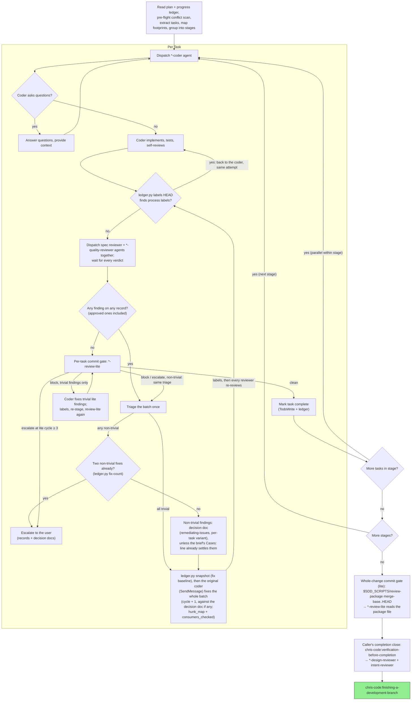

# Subagent-Driven Development

Execute plan by dispatching fresh subagent per task, with two review stages after each: spec compliance and code quality reviewers dispatched together (their findings triaged once), then a review-lite commit gate.

**Core principle:** Specialized coder agent per task → spec + quality review in parallel → one batched fix → commit gate. Fresh context per task, staged parallelism for independent tasks.

**Continuous execution:** Do not pause between tasks. The only reasons to stop: unresolvable BLOCKED status, ambiguity that prevents progress, or all tasks complete.

**Every task gets every gate.** The review stages (spec + quality together, then review-lite) applies to ALL tasks — not just the first one. You will feel pressure to skip gates on later tasks because "the pattern is established" or "this one is simple." That impulse is the exact failure mode this rule prevents. Task 5 gets the same gates as Task 1. No exceptions.

## Pre-Flight Plan Review

Before dispatching Task 1, load the progress ledger (see Durable Progress). Clear it first if it belongs to a finished run (the test is in Durable Progress), then resume at the first task not marked complete. Then read the plan once and check for:

- **Internal conflicts** — tasks that contradict each other or the plan's Constraints.
- **Plan-mandated defects** — anything the plan asks for that a reviewer would flag (a test that asserts nothing, verbatim duplication, a swallowed error).
- **Missing or thin `Cases:` lines** — `task_brief.py` refuses a task without one, and a list that skips obvious siblings or boundary inputs (`None`, empty, zero, negative) will ship one case at a time. Plans written before this rule have none at all; propose the lines and ask, then write the approved lines into the plan file (`task_brief.py` reads the plan, so an approval that stays in conversation still fails the brief).

Present everything you find to the user as one batched question, each finding beside the plan text that mandates it, asking which governs. If the scan is clean, proceed without comment. Do not interrupt per-discovery mid-run.

## The Process


```mermaid
flowchart TB
    subgraph Per Task
        coder["Dispatch *-coder agent"]
        questions{"Coder asks questions?"}
        answer["Answer questions, provide context"]
        implement["Coder implements, tests, self-reviews"]
        labels{"ledger.py labels HEAD<br/>finds process labels?"}
        reviews["Dispatch spec reviewer + *-quality-reviewer agents together;<br/>wait for every verdict"]
        reviews_ok{"Any finding on any record?<br/>(approved ones included)"}
        triage["Triage the batch once"]
        cap{"Two non-trivial fixes already?<br/>(ledger.py fix-count)"}
        escalate["Escalate to the user<br/>(records + decision docs)"]
        decision["Non-trivial findings: decision doc<br/>(remediating-issues, per-task variant),<br/>unless the brief's Cases: line already settles them"]
        fix["ledger.py snapshot (fix baseline), then the original coder<br/>(SendMessage) fixes the whole batch<br/>(cycle + 1, against the decision doc if any;<br/>hunk_map + consumers_checked)"]
        lite_fix["Coder fixes trivial lite findings;<br/>labels, re-stage, review-lite again"]
        commit_gate["Per-task commit gate: *-review-lite"]
        done["Mark task complete<br/>(TodoWrite + ledger)"]
    end

    read["Read plan + progress ledger,<br/>pre-flight conflict scan,<br/>extract tasks, map footprints, group into stages"]
    more_tasks{"More tasks in stage?"}
    more_stages{"More stages?"}
    final_gate["Whole-change commit gate (lite): $SDD_SCRIPTS/review-package merge-base..HEAD<br/>→ *-review-lite reads the package file"]
    verification["Caller's completion close: chris-code:verification-before-completion<br/>→ *-design-reviewer + intent-reviewer"]
    finish["chris-code:finishing-a-development-branch"]:::finish

    read --> coder
    coder --> questions
    questions -->|yes| answer
    answer --> coder
    questions -->|no| implement
    implement --> labels
    labels -->|"yes: back to the coder, same attempt"| implement
    labels -->|no| reviews
    reviews --> reviews_ok
    reviews_ok -->|yes| triage
    triage -->|all trivial| fix
    triage -->|any non-trivial| cap
    cap -->|yes| escalate
    cap -->|no| decision
    decision --> fix
    fix -->|"labels, then every reviewer re-reviews"| labels
    reviews_ok -->|no| commit_gate
    commit_gate -->|"block, trivial findings only"| lite_fix
    lite_fix --> commit_gate
    commit_gate -->|"block / escalate, non-trivial: same triage"| triage
    commit_gate -->|"escalate at lite cycle ≥ 3"| escalate
    commit_gate -->|clean| done
    done --> more_tasks
    more_tasks -->|"yes (parallel within stage)"| coder
    more_tasks -->|no| more_stages
    more_stages -->|"yes (next stage)"| coder
    more_stages -->|no| final_gate
    final_gate --> verification
    verification --> finish

    classDef finish fill:#90EE90,stroke:#333
```

## Agent Selection

### Coder Agents (exclusive — one coder per task)

Dispatch the most specific `*-coder` agent for the task's file types:

1. Check which file types the task will touch
2. Match against available `*-coder` agents by `scope.extensions`
3. If multiple match the same extension, resolve via `scope.require_dependencies` — most specific wins (e.g., `pytorch-coder` over `python-coder` when project depends on torch)
4. Concrete tiebreaker: if the code subclasses `nn.Module`, manipulates `torch.Tensor` shapes/devices, or implements a training-pipeline component (loss, callback, optimizer, scheduler, metric), dispatch `pytorch-coder`. Reserve `python-coder` for non-torch code (CLI, data I/O, config utils).
5. If no specific coder matches, fall back to a general-purpose agent

Only one coder agent writes the code. The one exception is an escalated consumer in another language during a fix (see *Route an escalated consumer*), where that language's coder changes only the consumer. The winning coder must be self-contained (includes both domain-specific and general language patterns).

### Review Agents (additive — all matching agents fire)

Unlike coders, `*-quality-reviewer` and `*-review-lite` agents are **additive**: all agents matching the file extensions fire on the same diff. In a PyTorch project, `.py` files get both `python-quality-reviewer` (general Python patterns) and `pytorch-quality-reviewer` (Lightning conventions, training correctness). If findings conflict, the more specific agent's guidance takes precedence.

### Model Selection

Use the least powerful model that can handle each role. **Announce the model and agent on every dispatch:**
- "Dispatching haiku python-coder agent for Task 3 (add utility function)"
- "Dispatching sonnet rust-coder agent for Task 5 (refactor pipeline)"
- "Dispatching opus general agent for final cross-cutting review"

| Model | When |
|-------|------|
| **Haiku** | Isolated functions, clear spec, 1–2 files, mechanical changes |
| **Sonnet** | Multi-file coordination, integration concerns, pattern matching |
| **Opus** | Architecture decisions, design judgment, broad codebase understanding, reviews |

## Task Scheduling

Use **staged parallelism**, not flat sequential or flat parallel dispatch.

1. **Map file footprints:** Before dispatching, identify every source file and test file each task will touch
2. **Group into stages:** Tasks within a stage must have zero file overlap (source AND test files). Tasks that share any file go in separate stages.
3. **Within a stage:** Dispatch subagents in parallel — they touch disjoint files and cannot conflict
4. **Between stages:** Wait for all tasks in the current stage to complete and pass review before starting the next stage

Common serialization triggers:
- Two tasks both modify the same test file (e.g., `conftest.py`, `test_utils.py`)
- Two tasks both touch a shared module (e.g., `models.py`, `lib.rs`)
- A later task depends on types/interfaces introduced by an earlier task

When in doubt, serialize. The cost of a conflict is higher than the cost of waiting.

## File Handoffs

Anything you paste into a dispatch — and anything a subagent prints back — stays resident in your context for the rest of the session. Hand artifacts over as files instead, all under one resolved store directory, per-worktree and uncommitted. Resolve it **once**, at the start of the session, and reuse it everywhere.

First pin where this skill's scripts live. A session runs from the user's project, but the scripts live at the plugin install path, so a repo-relative `scripts/…` resolves against the wrong directory. When the skill loads, Claude Code prints a "Base directory for this skill: …" line. `SDD_SCRIPTS` is that directory plus `/scripts`, as an absolute path, and every script call below goes through it:

```
SDD_SCRIPTS=<this skill's base directory>/scripts
STORE=$(python3 "$SDD_SCRIPTS/ledger.py" store-dir)
```

`ledger.py store-dir` is the single authority for the store location, and skills reference it instead of restating the derivation: the default is `.sdd/` at the repo toplevel (`git rev-parse --show-toplevel`), which resolves per-worktree — each linked worktree gets its own store — and lives in the working tree, never under `.git/`. `store-dir` also creates the directory and seeds a `.gitignore` containing `*` inside it, so the store ignores itself and its contents never show up as untracked, with no edit to the repo's own ignore rules. Agents are forbidden from computing their own paths (see below), so the path you hand them must come from this one call. Pass `--store "$STORE"` on every `ledger.py`/`task_brief.py` call this session (except `ledger.py diff-since`, which reads the working tree and takes no `--store`), and build every record path as `$STORE/task-N-<agent-name>.json`. To relocate the store (rarely needed), override via `STORE=$(python3 "$SDD_SCRIPTS/ledger.py" store-dir --store DIR)`, then use it identically everywhere; every subcommand except `diff-since` accepts `--store DIR`. One caveat of an in-tree store: `git clean -fdx` deletes it — don't run that mid-plan.

- **Task brief:** the brief is a *reference sheet*, not a restatement of the spec. From the repo root (it resolves `Consumes:` paths against the current directory), assemble it with `python3 "$SDD_SCRIPTS/task_brief.py" PLAN_FILE N --intent "..." [--note "..."]... [--spec SPEC_FILE] [--constraints-from PLAN_FILE] --store "$STORE" -o "$STORE/task-N-brief.md"` (repeat `--note` per cross-task note you hold; `--spec` is required only when the task entry contains a §-ref) — the script extracts the plan's task entry (its actions, `Consumes:` pointers, and spec §-references), embeds the intent and notes you pass it, copies the plan's Constraints verbatim when `--constraints-from` is given, and always appends the shared-shapes section (see Cross-Task Pattern Ledger). It fails loudly — non-zero exit, no file written — on a missing/empty `--intent`, a stale `Consumes:` pointer, or a missing, empty, or placeholder `Cases:` line; fix the plan or the intent rather than routing around the failure. The dispatch carries: (1) one line on where this task fits **and the observable outcome it must produce — the *why* (see Intent below)**; (2) the brief path, introduced as "read this first — your task and the sections to read"; (3) the spec path, where the coder reads the referenced §§; for a contract built by an earlier task, name the file or spec § rather than restating its signature; (4) the Global Constraints copied verbatim; (5) the report-file path; (6) the record path — `$STORE/task-N-<agent-name>.json`, or `$STORE/final-<agent-name>.json` at the whole-change gate, which has no task number (see Whole-Change Commit Gate); (7) the scripts path — `$SDD_SCRIPTS`, expanded to its absolute value (a subagent doesn't inherit your shell variables), which every record-writing agent needs to run `ledger.py check` on its own record before returning.
- **Intent (the *why*) — required:** a coder recovers *what* and *where* by reading the brief, the spec, and the repo, but it cannot recover *why* — the observable outcome this task serves. A fresh subagent does not inherit your conversation, so the brief is intent's only channel: the dispatch must carry it — one or two lines on the outcome this task must produce, quoting the relevant intent-ledger statement where one exists. Hand over the goal, not just the change — a coder given only *what* and *where* optimizes the diff and can ship the wrong thing correctly. If you cannot state the why, the task isn't ready to dispatch (the intent lives only in your head — externalize it or keep the task in-session).
- **Cross-task notes (orchestrator-only, terse):** beyond intent (above), the other thing the coder cannot recover by reading the spec and the repo is cross-task context. Add it to the brief as pointers and decisions, never as dereferenced spec content: a dependency contract (`built in Task M → path`), a conflict adjudication (`finding §5 governs the extent→band call`), a code entry point (the landing symbol, plus any new wire-key value), or a shared-shape pointer from the pattern ledger (see Cross-Task Pattern Ledger). Grounding beyond the entry point is the coder's job (its first step is to read the files it will touch), so point at the entry and let it trace the chain. Keep this to a few lines; if it grows, the requirement belongs in the spec, or the conflict belonged in the Pre-Flight Plan Review.
- **Report file:** name it after the brief (`task-N-brief.md` → `task-N-report.md`). The implementer writes its full report there and returns only status, the changed-file list, a one-line test summary, and concerns. This bullet is not the whole closing instruction: the same dispatch must also carry the record path and the scripts path (elements 6 and 7 above) — a dispatch that ends at "write your report and return the summary" produces no typed record, and the agent cannot self-supply the path it was never given.
- **Reviewer inputs:** spec-reviewer and `*-quality-reviewer` agents get the brief path, the report path, the changed-file list, the verbatim Constraints, the record path, the coder's record path (where a re-review reads the fix's `diagnosis`), the `Fix baseline: <tree>` and the task's file list on a re-review (for `ledger.py diff-since`), any decision doc for this task (on a re-review, so the reviewer judges the fix against its defended choice rather than re-litigating it), and the scripts path, and read the actual changed files. Do not paste diffs.
- **Review-lite inputs:** `*-review-lite` agents get only what their contract asks for — the staged diff (its default, via `git diff --cached`), or the review-package file path in its place at the whole-change gate, plus the verbatim Constraints, the record path, and the scripts path. No brief path, no report path, no changed-file list: it reviews exactly the diff it's handed, nothing else (see Whole-Change Commit Gate).
- **Staging and committing a task (you own both).** Coders never stage or commit. Once the spec and quality reviews are clean, stage exactly the task's files (`git add <task files>`, never `git add -A`, since parallel tasks share the working tree), dispatch the review-lite gate on that staged diff, and commit when it returns clean. Then append the completion entry, citing the commit.
- **Never** paste task text, prior-task summaries, or diffs into a dispatch or into your own context. A fresh subagent needs its brief, the interfaces it touches, and the constraints — nothing else.

## Cross-Task Pattern Ledger

You are the only actor who sees the task sequence — briefs carry intent and contracts, coders are scope-disciplined against out-of-task refactoring, reviewers see one diff. Cross-task shape tracking is therefore yours to act on, though the record-keeping itself is now automatic: coders declare `new_shared_symbols` and `duplication_pending` in their typed record (see the coder agent's Typed record section) instead of a prose sentinel, and `ledger.py shapes` derives the shared-shapes list from those records on the fly. Untracked, a shape repeated across tasks still lands as N verbatim copies that every per-task gate passes — the typing removes the "forgot to note it" failure, not the need to act on what's noted.

- **Shapes carry automatically:** every brief `task_brief.py` produces includes the shared-shapes section unconditionally (no flag disables it), so no manual append step is needed to populate it. If a later same-family task needs the pointer called out more directly than the brief's list does, add a cross-task note — "the composite dispatch lives at `<symbol>` — call it, don't re-inline."
- **On a `duplication_pending` entry** — visible via `python3 "$SDD_SCRIPTS/ledger.py" open --store "$STORE"` or read straight off a coder's record — assign the hoist to the next task whose footprint covers the owning file, or append a small hoist task if none does. Don't let it ride to the whole-change commit gate — by then the copies are committed and the fix is rework across N commits. Once the hoist lands, run `python3 "$SDD_SCRIPTS/ledger.py" resolve <id> --note "..." --store "$STORE"` so it stops appearing in `open` — `<id>` is content-derived (a digest of the entry, e.g. `task-1-python-coder#duplication_pending[a1b2c3d4]`), not a positional index, so copy it verbatim from `open`'s output rather than constructing it by hand; a rewritten record whose entry changes gets a new id even at the same field.
- **`ledger.py shapes` is incomplete while any `#malformed` item is open in `ledger.py open`.** A record that fails to parse or fails validation is skipped by `shapes` entirely, so its `new_shared_symbols` (and its `duplication_pending`) stay invisible until the writing agent fixes it with `ledger.py check`. Don't trust `shapes` as complete while `open` still lists a malformed record.

- **Unlisted cases feed forward.** A coder that handles a case its brief's `Cases:` line didn't list reports it as a `concerns` entry starting `unlisted case:`. That is a planning gap, not a problem with the task, so it doesn't make the task's status a concern to investigate. When a later task covers the same kind of rule (the same parameter shape, or the same validation applied elsewhere), add the case to that task's brief as a cross-task note (`--note`). When you claim completion, list every unlisted case alongside the follow-ups (`verification-before-completion`, *After Verification Passes*). Never edit the plan mid-run: this is how its gaps surface instead.

## Global Constraints

Copy the plan's Constraints section verbatim (exact values, formats, and stated relationships between components) into every implementer and reviewer dispatch. It is the reviewer's attention lens for what THIS project demands; the process rules already live in the agents and templates. This duplicates the Constraints section `task_brief.py --constraints-from` already writes into a coder's brief — deliberately, not paste-creep: the brief's copy is what the coder reads first, from its reference sheet; the dispatch's copy is what a reviewer's or the fallback template's primary framing sees immediately, without depending on whether it opened the brief for that purpose.

## Constructing Reviewer Dispatches

- **Never pre-judge.** Do not instruct a reviewer to ignore, not-flag, or pre-rate a finding. If your dispatch contains "do not flag," "at most Minor," or "the plan chose," stop — you are pre-judging to spare yourself a review loop. Let the reviewer raise it and adjudicate it in the loop.
- **Hand findings over by path, never by paraphrase.** When a review comes back `issues`, `block`, or `escalate`, the fix dispatch carries the reviewer's record path (and report path, where the contract writes one) and does not restate the findings. You still read them to decide what happens next, and you still ground judgment-shaped calls before acting on them, but the coder reads each finding in the reviewer's own words rather than in yours. Restating is where a finding quietly loses its severity, its `file:line`, or its reasoning — the hub corrupting the review signal is exactly what typed records exist to prevent.
- **Dispatch the spec reviewer and every matching `*-quality-reviewer` together, and never dispatch a fix while any of them is still out.** Accumulate every verdict first, then triage once and send one fix dispatch carrying every reviewer's record path. A fix dispatched against a partial verdict set buys one guaranteed extra round when the late reviewer's findings land. Every re-review cycle re-dispatches all of them at their same record paths, since a fix for one reviewer's finding can break another's verdict.
- **Triage the batch before the fix goes out.** The batch is every finding on every reviewer record, including findings attached to a `compliant` or `approved` verdict. Verify judgment-shaped findings first (see *Judging from Compressed Reports*), then sort each one:
  - **Trivial:** it changes no behavior, touches one site, and touches no contract (a docstring, comment, message or log text, local rename, or lint).
  - **Non-trivial:** everything else, including anything recurring or anything you hesitate to call trivial.

  Each non-trivial finding names its rule and the whole class that rule covers, within the task's changed files (a wider pattern goes in a concern, not this fix). That class, not the cited line, is the fix's case list. Check it against the brief's `Cases:` line: when the finding is about a rule the line covers, the line's cases are the class. When a non-trivial finding cites only a site and no `Cases:` entry covers it, ask the reviewer for its class (a `SendMessage`) before the fix goes out.
- **Route the triaged batch.**
  - An all-trivial batch goes straight to the coder.
  - A non-trivial finding that only reports a case the brief's `Cases:` line already lists, with its behavior (listed but not implemented or not tested), also goes straight to the coder: the plan already decided what to build.
  - Any other non-trivial finding first goes through `chris-code:remediating-issues`, per-task variant (name it in the dispatch). Dispatch a general-purpose agent to run it over those findings. Give it the reviewer record paths, the coder's record path, the brief path, the task's file list, any earlier decision docs for this task, the previous fix baseline (if a fix already ran), the scripts path (`$SDD_SCRIPTS`, expanded, for `diff-since`), the verbatim Constraints, and the output path `$STORE/task-N-decision-c<cycle>.md`, where `<cycle>` is the coder's upcoming fix cycle. It writes one decision doc there (consolidated research and a defended choice per finding) and returns only the path. The variant has no approval checkpoint, spec, or plan, so execution stays continuous. The fix dispatch then carries the decision doc path alongside the record paths, and the coder implements the defended choices it records.
- **Check for process labels before review.** Whenever a coder returns `done` or `done_with_concerns` (a first attempt or a fix), run `python3 "$SDD_SCRIPTS/ledger.py" labels HEAD <task files>` before dispatching the reviewers. It lists review-process labels (task, cycle and finding ids, decision-doc and reviewer vocabulary, store paths, commit hashes) on the task's added lines and exits 1 if it finds any. A hit the coder's `concerns` list as a `label false positive` (same file and line text) stands. Send any other hit back to the coder with `SendMessage`, as the same attempt: no snapshot, no cycle bump, no fix fields. Review starts once `labels` is clean, so a leaked label never costs a review cycle. A fix for review-lite findings gets the same check before review-lite runs again.
- **Record a fix baseline before every fix.** (A fix that paused with `needs_context` or `blocked` and is resuming is the same fix: re-send its original baseline; a new snapshot would absorb its partial edits and hide them from `hunk_map`.) Run `python3 "$SDD_SCRIPTS/ledger.py" snapshot --task N --label "pre-fix c<cycle>" --store "$STORE"`, where `<cycle>` is the upcoming fix cycle, adding `--non-trivial` when the fix batch has any non-trivial finding (from the reviewers or from review-lite); it prints a tree id. Those flagged snapshots are what `fix-count` counts. The coder's cycle-1 work is still uncommitted, so without this neither the coder nor the reviewers can tell the fix's hunks from the original ones. Pass `Fix baseline: <tree>` and the task's file list to the coder and to every re-reviewer. Each runs `ledger.py diff-since <tree> <task files>` to see the fix alone: the file list matters because the other tasks in the stage edit the same working tree at the same time, on files of their own.
- **Attach the review checklist to a non-trivial fix.** A fix batch with any non-trivial finding carries the checklist the fix will be judged by: every matching quality reviewer's contract, at `$SDD_SCRIPTS/../../../agents/<name>-quality-reviewer.md` (expanded to absolute; both python and pytorch in a PyTorch project). The coder self-reviews the fix against it as well as its own list. An all-trivial batch skips the checklist.
- **Route an escalated consumer.** A coder that finds a fix breaks a consumer it can't change itself (another language, or a public-API change) returns `done_with_concerns` naming the consumer. Dispatch that language's coder for the consumer, as part of this task's fix, with the parent task's brief, the coder's concern naming the consumer, the fix baseline and the task's file list (now including the consumer's file), and the scripts path. Give it its own record path (`$STORE/task-N-<agent-name>.json`) and report path (`$STORE/task-N-<agent-name>-report.md`) and starts at cycle 1, so its first record carries no fix fields. Add its quality reviewer to the re-review set, and tell every re-reviewer which files it changed: its hunks are accounted for by its own record, not the original coder's `hunk_map`. A public-API change escalates to the user, as it always has.
- **Send the fix to the original coder when you can.** If the agent that implemented the task is still reachable, continue it with `SendMessage` instead of dispatching a fresh one. It keeps the reasoning and invariants it built while implementing, and losing those is how a cold fixer breaks things the reviewers had approved. Fall back to a fresh dispatch at the same record path when it isn't reachable (after a compaction, a restart, or in another session). Either way, the coder's record path and cycle derivation are the same.
- **Fix dispatches re-point at the same record path.** The coder reads its own prior record there and self-derives `cycle` as prior + 1 — no counter passed, same mechanism as `*-review-lite`. From cycle 2 its record must carry a `diagnosis` (`root_cause`, `end_state`, `resolves_cluster` — `check` enforces it): the fix states the cause it resolves before patching, and the re-reviewing agents judge the fix against that stated cause, not just the finding sites. When a decision doc was produced, the diagnosis restates its root causes, so the reviewers judge the defended choice through it. A finished fix also carries a `hunk_map` (each changed hunk and the finding or choice it implements) and `consumers_checked` (each changed symbol's consumers and how each was verified), both enforced by `check`. Reviewers check those too: an unmapped hunk or an unchecked consumer earns a finding.
- **A non-empty `recurring` on a reviewer's record escalates the fix, not the review.** Recurrence — the same finding class at the same site across cycles — is typed evidence that patching failed. Read `recurring` off the reviewer records themselves: `ledger.py open` does not list it. A recurring finding is always non-trivial, and its decision doc must say why the previous mechanism failed and choose a different one, with at least two candidates weighed. New findings on newly reachable surface are *not* recurrence — a fix that makes a dead path real legitimately exposes new work; don't treat discovery as failure.
- **A non-empty `introduced_by_fix` is the same kind of signal.** It lists problems the fix itself caused, on lines of the fix diff or in a consumer of a symbol the fix changed: the fix regressed. Read it off the reviewer records (`open` doesn't list it either). Those findings are always non-trivial, and their decision doc must say how the previous fix broke them, read against that fix's diff (`diff-since` its baseline), `hunk_map`, and `consumers_checked`.
- **Two non-trivial fix attempts, then the user.** A task gets at most two non-trivial fix attempts, whatever triggered them (reviewer findings, a non-trivial lite finding, or a user ruling). The second one is where a recurrence-driven decision doc picks a different mechanism. Count them with `python3 "$SDD_SCRIPTS/ledger.py" fix-count --task N --store "$STORE"`, which counts the snapshots taken with `--non-trivial` (see *Record a fix baseline*). When a triaged batch still has a non-trivial finding open and the count is already 2, do not dispatch another fix: escalate. Neither cycle number is the count. A coder's `cycle` also advances on trivial fixes, and a reviewer re-dispatched within one cycle (a lost verdict, a retried dispatch) advances its own. Trivial-only leftovers at any point don't escalate: the coder fixes them and the reviewers re-review as usual, which is also what clears a reviewer's open `issues` status. The escalation briefing is the reviewer records, every decision doc for the task, and any `recurring` or `introduced_by_fix` entries. When the recurring-mechanism signature persisted *through* a decision-doc fix, those docs show the user the researched options and rejected alternatives instead of a loop to debug. Every other escalation signature (spec ambiguity, reviewer conflict, scope) escalates directly; research would only delay the adjudication. The user's ruling becomes the next fix's decision, and the reviewers re-review it as usual.
- **A reviewer finding closes only by re-review or by the user.** When the per-task decision doc's defended choice for a finding is that it can't or shouldn't be fixed as asked (no reachable fixture for a requested test, a requirement that conflicts with another), the doc records the evidence and no coder change is made for it. The coder still fixes the batch's other findings, if any. Then re-dispatch the reviewers with the decision doc path. A finding they no longer raise is closed. One they still raise escalates now, with the evidence in the briefing: leaving it unfixed was not a fix attempt, so another round would only repeat it. Never close a reviewer finding (an `issues` or `findings` entry) by your own ruling, and never accept code untested that a reviewer or the brief's `Cases:` line asked to be tested; that waiver is the user's to give. `cannot_verify` and `duplication_pending` items keep their own rules: you resolve those with `ledger.py resolve`, grounded as described above.
- **Re-dispatch `*-review-lite` at the same record path.** When a commit-gate `*-review-lite` returns block/escalate, the coder fixes, you re-stage the fixed files, and you re-dispatch the same agent on the new staged diff, pointed at the *same* dispatch-supplied record path as the first attempt. A trivial lite fix re-runs only review-lite. A non-trivial one changed behavior the reviewers approved, so the spec and quality reviewers re-review it first. The agent reads its own prior record there and self-derives `cycle` as `prior + 1` (else `1`) — dispatches carry no cycle counter, so there's nothing for you to pass or forget. Its findings get the same triage as the reviewers': a non-trivial one goes through the per-task decision doc before the coder fixes it. Its `escalate` means two different things. Below cycle 3, an `escalate` flags an S4+ finding: triage it like any non-trivial finding. At `cycle >= 3`, it is the loop-breaker, firing when a block condition (an S3+ finding or a failed linter) survived two fixes, and that goes to the user. `ledger.py` doesn't know which reviewers were supposed to fire for a task; if a record looks missing, that detection stays with you at integration time, not with the script.
- **Never narrow the mandate.** Do not reframe a reviewer's job to a subset of its remit ("just check for bugs," "only look at the parser," "skip the tests"). Each reviewer's system prompt defines its full scope — hand it the inputs and constraints, not a reduced charter. Under-cueing the scope is as corrosive as suppressing a finding: a design reviewer told to "look for bugs" stops reviewing design.
- **Do not** ask a reviewer to re-run tests the implementer already ran, or add open-ended directives ("check all uses") without a concrete, task-specific reason.
- **Plan-mandated defects are the user's call.** If a finding conflicts with what the plan mandates, present the finding and the plan text and ask which governs. Do not dismiss it because the plan mandated it, and do not dispatch a fix that contradicts the plan without asking.

## Judging from Compressed Reports

Everything a subagent hands back is a *compression*: a coder's report, a reviewer's verdict, a one-line status. You decide what to integrate from these compressions, one step removed from the evidence. The doers carry anti-over-trust discipline aimed at them ("Do Not Trust the Report"); you are the one seam where no one points that discipline back at *your* inputs. Apply it yourself.

Classify each thing a subagent tells you before acting on it:

- **Fact-shaped** — did the task complete? did the linter pass? did the suite go green? Checkable claims with a yes/no answer. Trust the ledger and the verdict; re-running them is the per-commit gate's job, not yours.
- **Judgment-shaped** — a "PASS with concerns," a cohesion call, a "cannot verify from diff," two reviewers that disagree, a coder's rationale for a deviation. These compress *reasoning*, and the reasoning is where the loss is. **Do not integrate a judgment-shaped verdict without grounding it in evidence.** A verdict you haven't grounded is an assertion you are laundering into a decision. Reviewers flag their own lossiness (a "Lossiness" line in their output); treat that as the map of what to ground first.

**Ground by dispatch, not by reading.** You do not need to open the changed code — that would cost you the very context this skill spends its file handoffs protecting, and the re-read you skip is invisible while the context you burn is not. What you need is to turn the verdict into a **decidable claim**, which takes only the verdict you already hold:

> "`process_data` now takes 8 parameters, 4 of them mode flags" — decidable by reading.
> "This will be hard to maintain" — not decidable; that is a judgment to adjudicate, not a claim to check.

Dispatch `claim-checker` with one claim, the file and line range, and nothing else — no verdict text, no reviewer reasoning, so it cannot anchor on the conclusion it is checking. It returns `holds` / `does-not-hold` / `not-decidable-by-reading` plus 3 to 10 verbatim lines. **The evidence is mandatory**: a bare verdict word would be one more laundering channel, exactly what this replaces. Because what comes back is quotation rather than conclusion, it needs no grounding of its own, and the chain stops there.

One claim per dispatch. Grounding informs how you act on a finding; it never overturns the reviewer's call.

When a claim comes back `not-decidable-by-reading`, or the evidence spans tasks and no single range settles it, **escalate with the evidence attached**, not with the summary. Hand the user (or the next dispatch) the actual lines and the conflicting claims, not your paraphrase.

And before you dispatch: **don't hand a subagent context you've only externalized in your head.** If a task's "why" lives only in this conversation and not in the brief, the spec, or the ledger, the fresh agent will reconstruct it wrong. Either write it into the brief (a pointer or a decision, per File Handoffs) or keep the task in-session. A fresh dispatch is the right tool only when its context is recoverable from artifacts.

## Handling ⚠️ Items

The spec-reviewer's "⚠️ Cannot verify from diff" line is typed: each item lands in its record's `cannot_verify` field (see spec-reviewer's Typed record) and surfaces in `python3 "$SDD_SCRIPTS/ledger.py" open --store "$STORE"`, keyed as `<record-stem>#cannot_verify[<digest>]` — content-derived from the entry, not a positional index, so copy the id verbatim from `open`'s output when resolving rather than constructing it by hand. These do not block the rest of the review, but resolve each one before marking the task complete: you hold the plan and cross-task context the reviewer lacks. The reviewer could not settle these because its scope was one diff, so resolve them at the scope it lacked: this is the judgment-shaped case from *Judging from Compressed Reports* — state the requirement as a decidable claim and dispatch `claim-checker` across the whole repo rather than the diff; don't act on the ⚠️ label or the `open` summary alone, and don't read the code yourself to do it. Once grounded, run `python3 "$SDD_SCRIPTS/ledger.py" resolve <id> --note "..." --store "$STORE"` so it stops appearing in `open`; a confirmed gap is a failed spec review instead — send it back to the coder and re-review (the re-review overwrites the record and its `cannot_verify` list).

## Durable Progress

Conversation memory does not survive compaction; a controller that loses its place can re-dispatch finished tasks. Track progress in the typed store, not only in TodoWrite.

- At start, run `python3 "$SDD_SCRIPTS/ledger.py" read --store "$STORE"` for the full store as markdown, `python3 "$SDD_SCRIPTS/ledger.py" open --store "$STORE"` for what's still unresolved, and `python3 "$SDD_SCRIPTS/ledger.py" completed --store "$STORE"` for which task ids are done. A task id listed by `completed` is DONE — do not re-dispatch it, even if `open` still lists a `duplication_pending` entry for it; the Pattern Ledger deliberately carries that forward as assigned work for a later task, not as evidence this one is unfinished (see Cross-Task Pattern Ledger and Red Flags). Any *other* open item on a completed task — `cannot_verify`, an unresolved status, a malformed record — means the completion was premature; treat it as unfinished and investigate before resuming past it. Resume at the first task id `completed` does not list. If the store belongs to a different branch or a stale run, `python3 "$SDD_SCRIPTS/ledger.py" clear --store "$STORE"` first. A close-gate remediation plan (see `chris-code:verification-before-completion`, *The Close Round*) is the same run, not a stale one: never clear its store, since that would erase the finished tasks and the close-round count. You can recognize one in `ledger.py read`: a `close round 1` entry, then a `close-gate remediation r1: plan <path>, …` note naming **the plan you were handed**, and no `close round 2` yet. Then resume that plan, and when its last task completes, the next steps are the whole-change commit gate (with `final-r2-*` records) and then verification's round 2 (`close-round --expect 2`), followed by the front-end the note names. A store whose close rounds belong to any other plan is a finished run, and so is one that already has round 2. Clear it before starting, or `completed` will skip your new plan's tasks as done. One case is ambiguous: round 1 with no round 2 and no remediation note at all. That can be a close interrupted (say, by compaction) before its note was written, so ask the user before clearing it. A malformed `progress.jsonl` line stops `read`/`open`/`completed` loudly (the error names the file and line): fix that line, or `clear` if the log is disposable — `append`, `shapes`, `store-dir`, and `check` keep working meanwhile.
- When a task's reviews come back clean, run `python3 "$SDD_SCRIPTS/ledger.py" append --type complete --task N --note "commits <base7>..<head7>, review clean" --store "$STORE"` alongside marking it done in TodoWrite. TodoWrite is your live view; the store — and `ledger.py completed` specifically — is the durable recovery map, a typed entry rather than a prose substring to pattern-match.
- Records are overwritten each cycle, so every passing `ledger.py check` also appends a summary line to `history.jsonl` in the store. `python3 "$SDD_SCRIPTS/ledger.py" stats --store "$STORE"` prints each task's verdicts cycle by cycle and lists the records that flagged `introduced_by_fix` or `recurring`. Read it when a task's cycle count climbs, and include it in the completion report.
- After compaction, re-pin `SDD_SCRIPTS` and re-resolve `$STORE` (see File Handoffs), since neither survives compaction. If the "Base directory for this skill" line is gone from context, reload this skill to get it back. Then rebuild the TodoWrite list from `ledger.py read --store "$STORE"`, `ledger.py open --store "$STORE"`, and `ledger.py completed --store "$STORE"`, and trust them and `git log` over your own recollection — `open` also surfaces anything left unresolved before the compaction hit (a `duplication_pending` entry, a `cannot_verify` item), not just task completion.

## Handling Implementer Status

Implementer subagents report one of four statuses. Handle each appropriately:

**DONE:** Run `labels` (see *Check for process labels before review*), then the spec + quality review.

**DONE_WITH_CONCERNS:** The implementer completed the work but flagged doubts. (An `unlisted case:` or `label false positive:` entry alone is informational: see *Unlisted cases feed forward* and *Check for process labels before review*.) Read the concerns before proceeding. If the concerns are about correctness or scope, address them before review — these are judgment-shaped (see *Judging from Compressed Reports*): ground the concern by `claim-checker` dispatch rather than acting on the summary. If they're observations (e.g., "this file is getting large"), note them and proceed to review.

**NEEDS_CONTEXT:** The implementer needs information that wasn't provided. Provide the missing context and re-dispatch. A fix that paused this way resumes with its original `Fix baseline` and task file list, not a new snapshot.

**BLOCKED:** The implementer cannot complete the task. Assess the blocker:
1. If it's a context problem, provide more context and re-dispatch with the same model
2. If the task requires more reasoning, re-dispatch with a more capable model
3. If the task is too large, break it into smaller pieces
4. If the plan itself is wrong, escalate to the human

A fix that was blocked and is re-dispatched (cases 1–2) resumes with its original `Fix baseline` and task file list, not a new snapshot, exactly like a NEEDS_CONTEXT resume.

**Never** ignore an escalation or force the same model to retry without changes. If the implementer said it's stuck, something needs to change.

## Whole-Change Commit Gate (lite, not the completion gate)

After the last stage, run one review over the whole change. The per-commit gates each saw a single commit in isolation, so cross-commit idiom drift — a helper duplicated across two tasks, an inconsistency between Task 1 and Task 5 — can pass every per-commit gate and still land.

The task commits are already in, so `git diff --cached` is empty and `*-review-lite` cannot use its default staged-diff path. Hand it the whole-change diff as a file instead:

1. `BASE=$(git merge-base HEAD <base-branch>)`, `HEAD=$(git rev-parse HEAD)`.
2. Run `"$SDD_SCRIPTS/review-package" "$BASE" "$HEAD" "$STORE/review-whole-change.diff"` — it writes the commit list, stat, and full multi-commit diff to that file and prints the path (the diff never enters your context). Pass the explicit `$STORE` outfile: the script's own default resolves the session-independent default store, which is the wrong location when the session overrode `--store`.
3. Dispatch each matching `*-review-lite` agent with that package-file path, a record path at `$STORE/final-<agent-name>.json` (`"task": "final"` — this gate has no task number; in a close-gate remediation run use `$STORE/final-r2-<agent-name>.json` instead, so the agent doesn't inherit the original run's gate cycle; `$STORE` is the same resolved store from File Handoffs), and the scripts path. The agent reads the package and reviews the whole-change diff, not `--cached`.

Handle block/escalate exactly as at a per-commit gate — re-dispatch at the same record path so the agent self-derives `cycle` from its own prior record.

**This gate is necessary, not sufficient.** It is the diff-level idiom check applied across commits; it doesn't exercise behavior or assess architecture. After it passes, the caller still owes the heavyweight close: `chris-code:verification-before-completion` (the `*-design-reviewer` cohesion gate and the `intent-reviewer` spec-blind behavior check), then `chris-code:finishing-a-development-branch`. A green suite plus a passing lite gate is not "verified": a green suite proves the assertions you wrote pass, not that behavior is correct or the design coheres. The close is mandatory either way: a front-end (`coherent-change`, `remediating-issues`) owns it if one drove SDD; on direct invocation you do. Being the caller is not an exemption. In a close-gate remediation run, that close *is* verification's round 2: invoke it once, not once for SDD and again for the front-end.

## Prompt Templates

- `./implementer-prompt.md` - Dispatch implementer subagent (used when no `*-coder` agent matches)

Spec compliance review is handled by the registered `spec-reviewer` agent (read-only on the checkout aside from its own typed record, language-agnostic — see Typed record in spec-reviewer.md) — dispatch it explicitly per task; it carries its own mandate (do-not-trust-the-report, instruction precedence), so no prompt template is needed. Quality review is handled by `*-quality-reviewer` agents (e.g., `python-quality-reviewer`, `rust-quality-reviewer`), dispatched by scope matching.

All dispatches use file handoffs (see File Handoffs): pass brief, report, record, and scripts paths plus verbatim Constraints, never pasted task text or diffs.

## Example Workflow

```
[Read plan: .claude/output/plans/feature-plan.md]
[Pin the scripts: SDD_SCRIPTS=<base directory from the skill-load header>/scripts]
[Resolve the store once: STORE=$(python3 "$SDD_SCRIPTS/ledger.py" store-dir)]
[python3 "$SDD_SCRIPTS/ledger.py" read --store "$STORE" + open --store "$STORE" + completed --store "$STORE" → empty store, start at Task 1]
[Extract 5 tasks, map file footprints, group into 3 stages]
[Stage 1: Tasks 1,2 (disjoint files) | Stage 2: Task 3 | Stage 3: Tasks 4,5 (disjoint)]

Stage 1 — dispatching 2 tasks in parallel:
  [python3 "$SDD_SCRIPTS/task_brief.py" feature-plan.md 1 --intent "..." --store "$STORE" -o "$STORE/task-1-brief.md"]
  [python3 "$SDD_SCRIPTS/task_brief.py" feature-plan.md 2 --intent "..." --store "$STORE" -o "$STORE/task-2-brief.md"]
  "Dispatching sonnet python-coder agent for Task 1 (add CLI hook)"
    — brief $STORE/task-1-brief.md, record $STORE/task-1-python-coder.json
  "Dispatching haiku python-coder agent for Task 2 (add utility function)"
    — brief $STORE/task-2-brief.md, record $STORE/task-2-python-coder.json

  Task 1: coder writes task-1-python-coder.json (done, duplication_pending: 1 site) →
    spec reviewer ✅ + quality reviewer ❌ (dispatched together; S3: hidden side effect
    in helper) → triage: non-trivial → per-task decision doc → coder fixes against it
    (cycle 2, diagnosis) → spec reviewer ✅ + quality reviewer ✅ → python-review-lite ✅
    (self-derived cycle 1) →
    `ledger.py append --type complete --task 1 --note "..." --store "$STORE"`
    → mark complete (the open duplication_pending below doesn't block this — see Durable
    Progress and Red Flags)
  Task 2: coder completes → spec reviewer ✅ + quality reviewer ✅ → python-review-lite ✅
    → mark complete

  [python3 "$SDD_SCRIPTS/ledger.py" open --store "$STORE" → task-1-python-coder#duplication_pending[a1b2c3d4]
   still open; Task 3 owns the file, so its brief carries the pointer as a cross-task note]

Stage 2:
  [python3 "$SDD_SCRIPTS/task_brief.py" feature-plan.md 3 --intent "..."
    --note "hoist the helper task-1-python-coder flagged, see ledger open"
    --store "$STORE" -o "$STORE/task-3-brief.md"]
  "Dispatching sonnet python-coder agent for Task 3 (refactor shared module)"
    — brief $STORE/task-3-brief.md, record $STORE/task-3-python-coder.json
  [Task 3 shares conftest.py with Tasks 1,2 — must wait for Stage 1]

  Task 3: coder hoists the helper (new_shared_symbols: 1) → reviews pass → commit gate →
    `ledger.py resolve task-1-python-coder#duplication_pending[a1b2c3d4] --note "hoisted in Task 3"
    --store "$STORE"` → mark complete
  [Task 4's brief now carries the hoisted helper automatically in its shared-shapes section]

Stage 3 — dispatching 2 tasks in parallel:
  "Dispatching sonnet rust-coder agent for Task 4 (add FFI binding)"
  "Dispatching haiku python-coder agent for Task 5 (add Python wrapper)"

  [Both complete → reviews → commit gates (rust-review-lite + python-review-lite, each
    self-deriving its own cycle) → mark complete]

[Whole-change commit gate (lite): $SDD_SCRIPTS/review-package base..HEAD → python-review-lite +
  rust-review-lite read the package file, write $STORE/final-python-review-lite.json /
  $STORE/final-rust-review-lite.json]
[Caller's completion close: chris-code:verification-before-completion → *-design-reviewer + intent-reviewer]
[chris-code:finishing-a-development-branch]
```

## Red Flags

- Never start implementation on main/master without explicit user consent
- Never skip reviews (spec compliance OR quality) or proceed with unfixed issues
- Never dispatch subagents in parallel when their file footprints overlap
- Never paste task text or diffs into a dispatch or your own context — hand the task brief as a file (`python3 "$SDD_SCRIPTS/task_brief.py"`), and never hand a subagent the whole plan file
- Never coach a reviewer to suppress, soften, or pre-rate a finding
- Never dispatch a fix before every spec and quality verdict for the task is in
- Never send a non-trivial finding to the coder without a per-task decision doc (`chris-code:remediating-issues`, per-task variant), unless it only reports a case the brief's `Cases:` line already lists
- Never dispatch a fresh fixer when the original coder is still reachable by `SendMessage`, and never send a fix without a `snapshot` baseline, or a non-trivial fix without the matching quality reviewers' checklist paths
- Never mark a task complete with a `cannot_verify` item, an unresolved status, or a malformed record still open in `ledger.py open` for that task — an open `duplication_pending` entry alone does not block completion; the Pattern Ledger deliberately assigns its hoist to a later task
- Never enter the whole-change commit gate with an open `duplication_pending` entry in `ledger.py open` — resolve it (the hoist landed) or reassign it to a task still ahead first
- Never re-dispatch a task `ledger.py completed` lists
- Never construct a dispatch brief by hand when `task_brief.py` can produce it — a hand-assembled brief skips `Consumes:` validation and the shared-shapes section
- Never construct a resolution id by hand — ids are content-derived (a digest of the entry), not positional, so copy them verbatim from `ledger.py open`'s output
- Never pass a `cycle` value in a `*-review-lite` dispatch — dispatches carry no cycle counter; the agent self-derives `cycle` from its own prior record at the same record path
- Never let a subagent compute its own record or scripts path — the dispatch supplies both, exactly as it supplies the report path
- Never move to next task while any review has open issues
- If reviewers find issues: triage the batch → decision doc for any non-trivial finding → coder fixes the whole batch → `labels` clean → every reviewer re-reviews → repeat until approved (a non-trivial finding still open after two non-trivial fixes escalates)
- If a subagent is blocked: provide more context, upgrade model, or break the task apart — never force retry without changes

## Integration

**Required workflow skills:**
- **chris-code:using-git-worktrees** - Ensures isolated workspace
- **chris-code:lean-plan** - Creates the plan this skill executes
- **chris-code:requesting-code-review** - Ad-hoc reviews outside these gates (the gate reviewers are registered agents and need no template)
- **chris-code:finishing-a-development-branch** - Complete development after all tasks

**Agents:**
- **`*-coder` agents** - Specialized implementers, auto-dispatched by file type
- **`spec-reviewer`** - Read-only spec-compliance gate aside from its own typed record, dispatched explicitly per task (language-agnostic)
- **`*-quality-reviewer` agents** - Design quality + bug detection review, auto-dispatched by file type
- **`*-review-lite` agents** - Commit gates (idiom + lint), auto-dispatched by file type

**Subagents should use:**
- **chris-code:test-driven-development** - Subagents follow TDD for each task

**Alternative workflow:**
- **chris-code:executing-plans** - Use for inline execution without subagents
